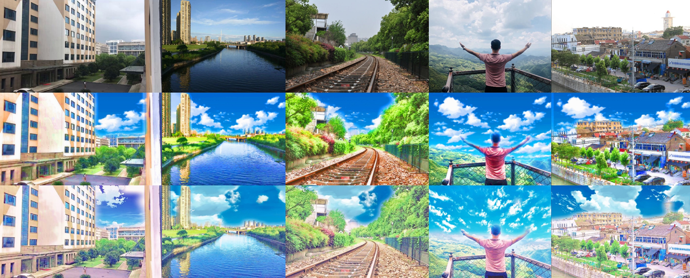
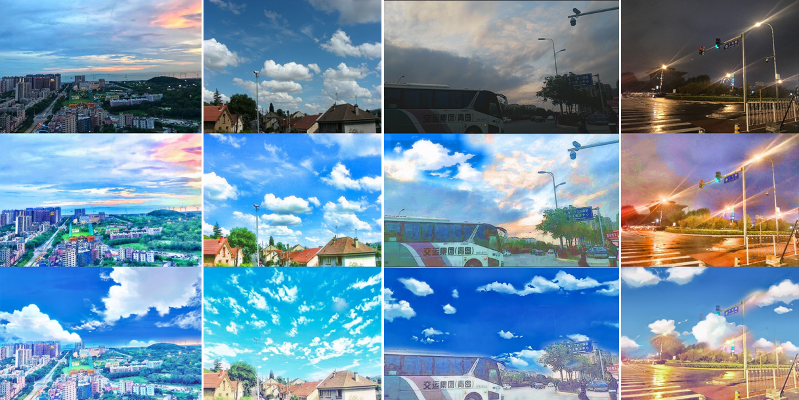
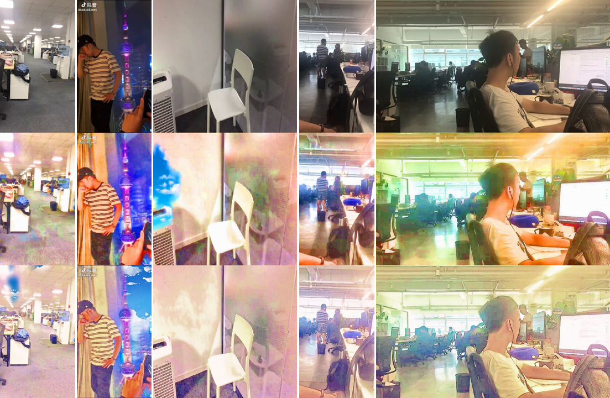
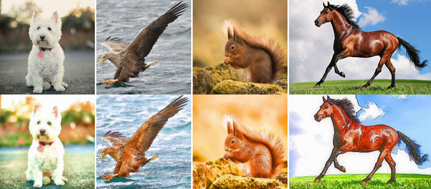
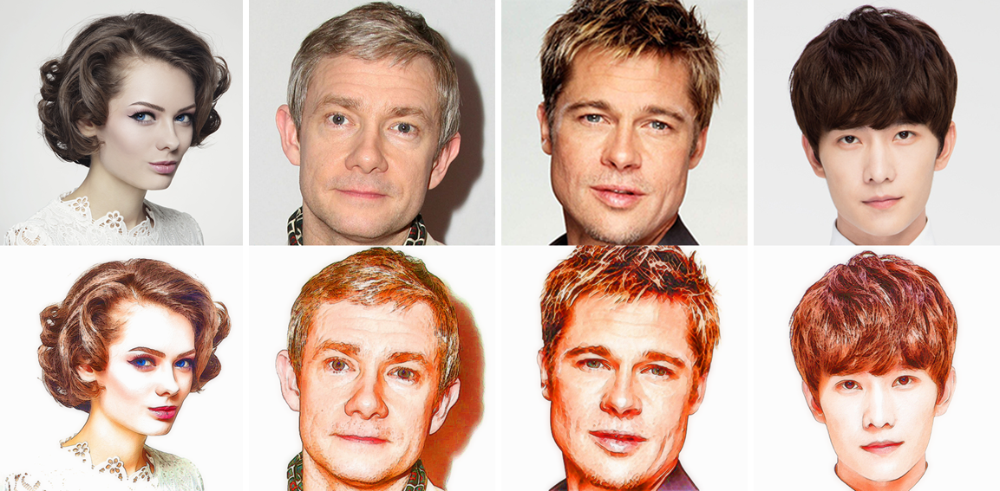
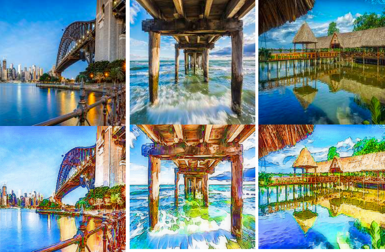
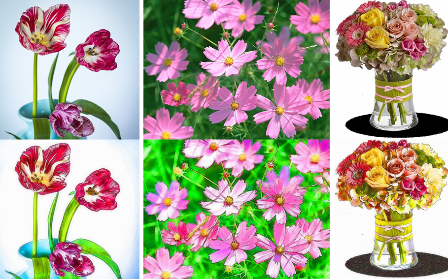
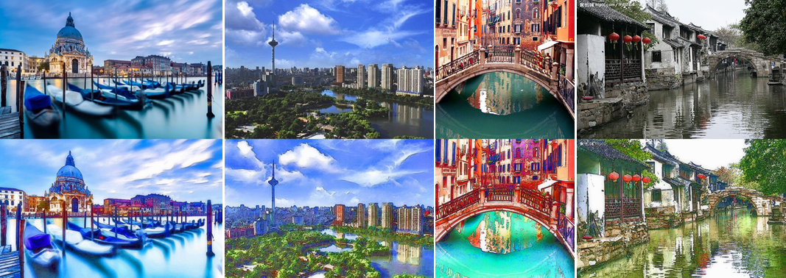
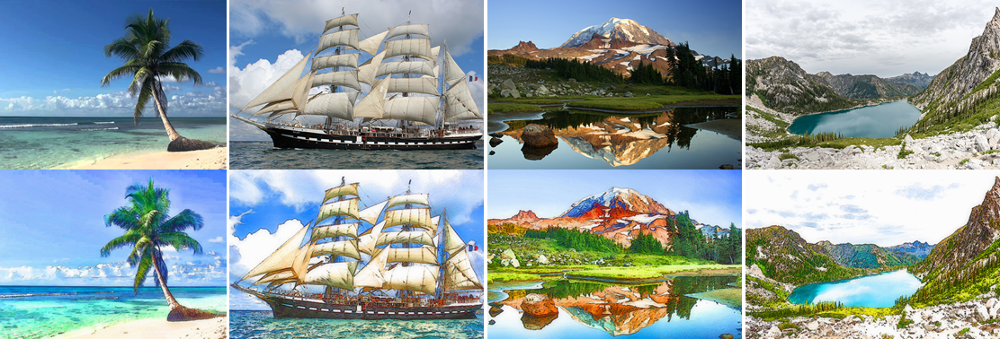
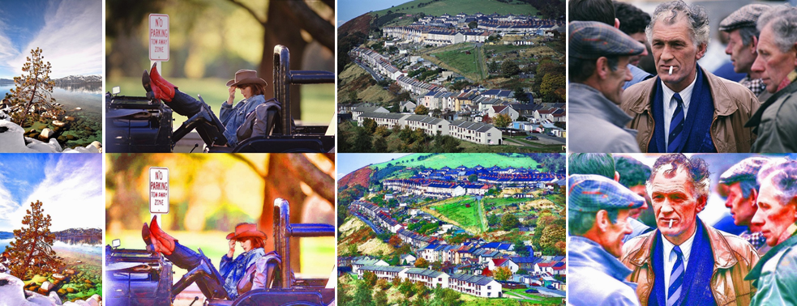

# 风格化传统方法结果总结_2018_08_26

## 结论

- **目前进展**

  - 已把传统方法的整个流程（预处理、卡通化、色彩调整、天空替换）整体走通
  - 效果上单帧图像与"时光相册"差不太多，问题在于颜色略微差异+天空误检漏检
  - 效果上视频风格化效果不好，问题在于视频帧间天空误检漏检不一致问题
  - 速度上还在工程化中，目前速度还不能估计...

- **目前最大问题**

  + 传统方法几乎解决不了天空检测的鲁棒性问题

- **后续计划**

  + 因为调参非常耗时，只能先把深度的一起做起来。等深度做起来后再根据需要，针对需要用到的模块进行调参

  + 跟游戏那边沟通下，先拿些他们的图像/视频样本，根据他们的样本看看能不能调调参数

    

### 效果展示

#### 1. 与"时光相册"对比（风景图）

从上往下依次是：原图、我们的结果、时光相册的结果

**对比结论**：整体效果差不多，我们的颜色更亮一些

#### 2. 与"时光相册"对比（天空检测比较难的图）

从上往下依次是：原图、我们的结果、时光相册的结果

**对比结论**：我们的天空检测存在更多漏检。针对颜色多样的天空、云彩纹理丰富的天空、灰暗的天空、黑夜天孔等鲁棒性不足（传统方法很可能都会遇到这样的问题，除非用上非常复杂的规则参数或者模型，所以我怀疑他们的天空检测真的是用传统方法？）

#### 3. 与"时光相册"对比（室内图）

从上往下依次是：原图、我们的结果、时光相册的结果

**对比结论**：针对室内的都不太好，我们的天空误检可能更多一点，另外，我们的噪声块多一些（颜色与周围不太一样的）

#### 4. 针对视频的效果

待续...

#### 5. 卡通效果在不同场景下的图

从上往下依次是：原图、我们的卡通动漫结果（没有贴天空而已）

##### 动物

##### 人脸

##### 动漫风格图

##### 鲜花

##### 风景图+建筑图+其他图

## 效果整体分析

1. 对单帧图像，"新海诚"效果与"时光相册"相比效果差一些，整体效果比较接近，不同点在于：
   - 卡通效果上看：我们的颜色更深，光线亮度更暗，另外，存在的噪声块多一点点
     - **原因分析**： 传统方法的某些个参数没有按他们的调，以及少了他们的某一两步
     - **解决办法**： 只能调参，但是传统方法参数不要太多啊...这个需要大量时间和精力调，感觉做起来太慢
   - 贴天空上看：我们的天空检测误检漏检比较多，仅能处理简单场景情况
     - **原因分析**： 我们的算法考虑速度都是使用最简单的传统方法的策略，不如"时光相册"的鲁棒（不知道他们的天空究竟是不是用传统方法做的）。另外，天空的素材上我也只是随便找了几张，在合成图的时候需要一些策略进行挑图合并图，这边也需要许多规则，需要花较多时间做
     - **解决办法**：后续继续优化（暂时没有好的思路，可能深度方法鲁棒性会更强）
2. 对视频，除了上面单帧图像的问题，还有存在帧与帧之间的不连续性、抖动性等问题。但最严重的还是天空的影响（在连续帧之间不同）。另外，效果与测试视频有一定关系（不适用室内场景）
3. 速度来说，还在工程化，目前速度还不能估计...
4. 卡通效果滤镜——不考虑实现"新海诚"风格，仅考虑卡通效果，效果还可以。

## 后续详细工作思路

##### 传统方法

+ 解决颜色偏深
  1. 需要把颜色变得再淡一些，自然一些： 加柔和光、调整颜色对比度、调整已有参数
+ 解决天空误检漏检
  1. 搜集符合新海诚风格的天空图
  2. 对图做随机变换
  3. 制定选图策略
  4. 贴图参数调整
  5. 确定贴图与整体图像颜色调整的顺序参数等
  6. 其他天空检测思路？？？
+ 解决由于sharp/hsv调整导致出现部分颜色噪声块
  1. 做一定平滑，加权融合等

##### 深度方法

+ 先用“在线方法”训练模型生成“新海诚”风格的效果看看
+ 用cartoon-gan训练
+ 用stylebank训练
+ 用其他方法训练
+ 用深度方法训练天空检测模型
+ 

## 收获与感想小结

+ 传统方法步骤太多，参数太多，鲁棒性不好。两个相对独立的操作只是调一下顺序都有可能对结果造成很大影响，更别提是换颜色空间做，用不同方法实现同一功能等等。那么多方法、参数都要很多时间去尝试、实验，经验很重要
+ 风格化是个很杂的领域，涉及很多方面的知识，比如图像处理、纹理生成、图像渲染（涉及新海诚这种动漫风格的还涉及非真实感渲染），以及现在大部分风格化paper里所定义的狭义的"风格化迁移"。如果还考虑到天空检测的问题，除了上面的问题，还需要图像分割、目标检测等等——当然，这些都是我认为如果要用传统方法做，或者要真正做好风格化需要学习和掌握的。如果只是用深度学习，那可能就另当别论了，毕竟强大的DL能把这些门槛都大大降低了
+ 风格化的效果，跟样本、场景关系特别大。也就是说，**风格化是做不到通用的（针对大部分图都效果好），最多只能相对通用（针对某一类或某几类效果更好）**。这个原因有几个，第一，风格化效果主观性太强，每个人看法都不一样。而且，风格化并不像目标检测等领域有规范化、量化的指标和标准来衡量，paper里的效果对比都是直接给出图让读者自己去评判；第二，风格化本身效果很取决于训练目标与测试目标的"相似性"（我指的是广义的相似性，比如颜色、内容成分、笔触、画风等等，而不是图片的相似度），所以当同一个算法（or模型）用在"相似图片"上效果好，用在"不相似的图片"上效果就不好，这很难判断到底该算法是否好。另外，如何判断图像之间的"相似性"这一点也没有什么固定的标准，可能更多是人为总结得出的判断和依据（这一点如果能得出一个相对通用的结论，可能是发paper的一个很好的点，之前廖菁好像是说微软那边目前有在做类似工作）
+ 即使是上深度学习方法，前期还是需要用传统方法做些预处理的。比如针对暗图做些gamma变换等，白天黑夜检测等
+ 风格化从难度来说，做好视频风格化的难度远远大于单帧图像的效果。第一，速度处理要求实时；第二，视频图像需要相邻帧之间的效果变化小（不能出现抖动），这一点对算法鲁棒性要求很高，而且，在处理效果时，不能只处理单帧图，可能要考虑前后帧，整体算法的复杂性和计算量都高很多；
+ 通过和"时光相册"的对比，我猜想他们的滤镜风格方法：
  + 1. 他们的”动漫风“和”暮色星空“两个滤镜应该是用传统方法做的（除了天空检测那部分），这两个应该只是修改了一些参数，整体pipeline肯定用的同一个。也是因为对比这两个效果，我才确定是传统方法，二者只是天空换了，色调等换了。深度方法一定会有随机性，也不可能像素级上那么精细（相似）
    2. 他们的天空检测很可能是深度方法、或者是机器学习方法，因为前面有很难的天空（颜色、纹理都很复杂），但他们的方法都能检测出来，传统方法得相当复杂的系统才搞的定
    3. 他们的“赤壁”、“立体”、...、“靛青”这些滤镜用的是深度方法做的，因为笔触和细节都已经没有“动漫风”和“暮色星空”那样精细
    4. 他们的其他滤镜风格都是传统方法，随便换些参数（比如色调参数、颜色迁移的guide图等等）
+ 整个天空检测，要做好它，就是一个浩大的工程...
+ 整体感觉，倩女这个需求，他们可能期待的太高了。即使是时光相册的方法——效果上，也只能在例如风景图上效果还可以，室内、人物场景也不好。速度上，如果天空是用深度做的，那么整体速度应该是做不到手机上实时的。如果要用传统方法做，那么效果上不会好且适用范围窄，视频的稳定性上也差。微软的廖菁之前提过，目前整个业内（学术+工业界）风格化做到手机端实时的也是几乎做不到的。

