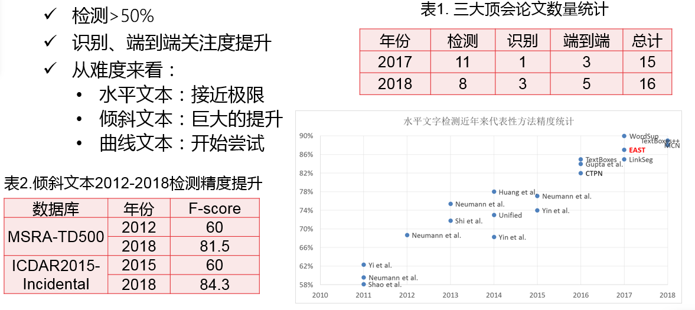
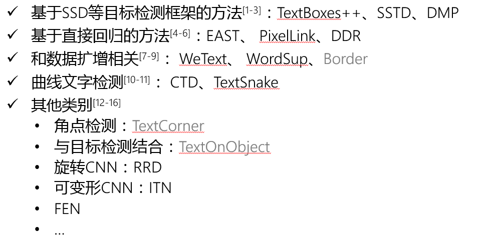

# 2017-2018_OCR_papers

## 1. 简单背景

### 基于深度的OCR方法的发展历程

### 近年来OCR发展热点与趋势

### 检测方法按照主题进行分类

## 2. ECCV + CVPR + ICCV +AAAI

### 检测

+ 水平文本
  + Shangxuan Tian——【ICCV2017】WeText_Scene Text Detection under Weak Supervision
  + Shitala Prasad——【ECCV2018】Using Object Information for Spotting Text
  + XiangBai——【AAAI2017】TextBoxes_A Fast Text Detector with a Single Deep Neural Network
  + Sheng Zhang——【AAAI2018】Feature Enhancement Network_A Refined Scene Text Detector

+ 倾斜文本
  + ChengLin Liu——【ICCV2017】Deep Direct Regression for Multi-Oriented Scene Text Detection
  + Chuhui Xue——【ECCV2018】Accurate Scene Text Detection through Border Semantics Awareness and Bootstrapping
  + Cong Yao——【CVPR2017】EAST_An Efficient and Accurate Scene Text Detector
  + Dafang He——【CVPR2017】Multi-Scale FCN With Cascaded Instance Aware Segmentation for Arbitrary Oriented Word Spotting in the Wild
  + Dan Deng——【AAAI2018】PixelLink_Detecting Scene Text via Instance Segmentation
  + Fangfang Wang——【CVPR2018】Geometry-Aware Scene Text Detection With Instance Transformation Network
  + Han Hu——【ICCV2017】WordSup_Exploiting Word Annotations for Character based Text Detection
  + Lianwen Jin——【CVPR2017】Deep Matching Prior Network_Toward Tighter Multi-oriented Text Detection
  + Pan He——【ICCV2017】Single Shot Text Detector With Regional Attention
  + XiangBai——【CVPR2017】Detecting Oriented Text in Natural Images by link Segments
  + XiangBai——【CVPR2018】Multi-Oriented Scene Text Detection via Corner Localization and Region Segmentation
  + XiangBai——【CVPR2018】Rotation-Sensitive Regression for Oriented Scene Text Detection
  + Yingli Tian——【CVPR2017】Unambiguous Text Localization and Retrieval for Cluttered Scenes
  + Yue Wu——【ICCV2017】Self-Organized Text Detection With Minimal Post-Processing via Border Learning
  + Zichuang Liu——【CVPR2018】Learning Markov Clustering Networks for Scene Text Detection
+ 曲线文本
  + Shangbang Long——【ECCV2018】TextSnake_A Flexible Representation for Detecting Text of Arbitrary Shapes

### 识别

- Wei Liu——【AAAI2018】Char-Net_A Character-Aware Neural Network for Distorted Scene Text Recognition
- Yang Liu——【ECCV2018】Synthetically Supervised Feature Learning for Scene Text Recognition
- Zhanzhan Cheng——【CVPR2018】AON  Towards Arbitrarily-Oriented Text Recognition
- Zhanzhan Cheng——【CVPR2018】Edit Probability for Scene Text Recognition
- Zhanzhan Cheng——【ICCV2017】Focusing Attention_Towards Accurate Text Recognition in Natural Images
- Zichuan Liu——【AAAI2018】SqueezedText_A Real-time Scene Text Recognition by Binary Convolutional

### 检测+识别

- Christian Bartz——【AAAI2018】SEE_Towards Semi-Supervised End-to-End Scene Text Recognition
- Chulmoo Kang——【AAAI2017】Detection and Recognition of Text Embedded in Online Images via Neural Context Models
- Chunhua Shen——【ICCV2017】Towards End-to-end Text Spotting with Convolutional Recurrent
- Fangneng Zhan——【ECCV2018】Verisimilar Image Synthesis for Accurate Detection and Recognition of Texts in Scenes
- Lluis Gomez——【ECCV2018】Single Shot Scene Text Retrieval
- Lukas Neumann——【ICCV2017】Deep TextSpotter_An End-to-End Trainable Scene Text Localization and Recognition Framework
- Weilin Huang——【CVPR2018】An End-to-End TextSpotter With Explicit Alignment and Attention
- XiangBai——【ECCV2018】Mask TextSpotter An End-to-End Trainable Neural Network for Spotting Text with Arbitrary Shapes
- XiangBai——【PAMI2018】ASTER_An Attentional Scene Text Recognizer with Flexible Rectification
- YuQiao——【CVPR2018】FOTS  Fast Oriented Text Spotting With a Unified Network

## 3. 其他CV会议期刊

### 2017年

- Daitao Xing——【2017】ArbiText_Arbitrary-Oriented Text Detection in Unconstrained Scene
- Dena Bazazian——【2017】Improving Text Proposals for Scene Images with Fully Convolutional Networks
- Fan Jiang——【2017】Deep Scene Text Detection with Connected Component Proposals
- Jiaqi Ma——【2017】Arbitrary-Oriented Scene Text Detection via Rotation Proposals
- Lluis Gomez——【PR2017】TextProposals_A text-specific selective search algorithm for word spotting in the wild
- Siyang Qin——【2017】Cascaded Segmentation-Detection Networks for Word-Level TextSpotting
- Suman Ghosh——【2017】R-PHOC_Segmentation-Free Word Spotting using CNN
- Xiangyu Zhu——【ICDAR2017】Deep Residual Text Detection Network for Scene Text
- Yingying Jiang——【2017】R2CNN_Rotational Region CNN for Orientation Robust Scene Text Detection
- Yuchen Dai——【2017】Fused Text Segmentation Networks for Multi-Oriented Scene Text Detection
- **Yuliang Liu——【2017】Detecting Curve Text in the Wild_New Dataset and New Solution(曲线文本)**

### 2018年

- Chunhua Shen——【2018】Correlation Propagation Networks for Scene Text Detection
- Dafang He——【2018】TextContourNet_a Flexible and Effective Framework for Improving Scene Text
- Jun Du——【ICPR2018】Sliding Line Point Regression for Shape Robust Scene Text Detection
- Qiangpeng Yang——【IJCAI2018】IncepText_A New Inception-Text Module with Deformable PSROI Pooling for Multi-Oriented Scene Text Detection
- QiYuan——【2018】A Single Shot Text Detector with Scale-adaptive Anchors
- **XiangBai——【2018TIP】TextBoxes++_A Single-Shot Oriented Scene Text Detector**
- **XiangBai——【PAMI2018】ASTER_An Attentional Scene Text Recognizer with Flexible Rectification**
- XiangLi——【2018】Shape Robust Text Detection with Progressive Scale Expansion Network
- Yu Qiao——【BMVC2018】Boosting up Scene Text Detectors with Guided CNN
- Zhuoyao Zhong——【2018】An Anchor-Free Region Proposal Network for Faster R-CNN based Text Detection Approaches

## 参考文献

1. He P, Huang W, He T, et al. Single shot text detector with regional attention[C]//The IEEE International Conference on Computer Vision (ICCV). 2017, 6(7).
2. Liu Y, Jin L. Deep matching prior network: Toward tighter multi-oriented text detection[C]//Proc. CVPR. 2017: 3454-3461.
3. Liao M, Shi B, Bai X. Textboxes++: A single-shot oriented scene text detector[J]. IEEE Transactions on Image Processing, 2018, 27(8): 3676-3690.
4. He W, Zhang X Y, Yin F, et al. Deep direct regression for multi-oriented scene text detection[J]. arXiv preprint arXiv:1703.08289, 2017.
5. Zhou X, Yao C, Wen H, et al. EAST: an efficient and accurate scene text detector[C]//Proc. CVPR. 2017: 2642-2651.
6. Deng D, Liu H, Li X, et al. PixelLink: Detecting Scene Text via Instance Segmentation[J]. arXiv preprint arXiv:1801.01315, 2018.
7. Hu H, Zhang C, Luo Y, et al. Wordsup: Exploiting word annotations for character based text detection[C]//Proc. ICCV. 2017.
8. Tian S, Lu S, Li C. Wetext: Scene text detection under weak supervision[C]//Proc. ICCV. 2017.
9. Xue C, Lu S, Zhan F. Accurate Scene Text Detection Through Border Semantics Awareness and Bootstrapping[C]//European Conference on Computer Vision. Springer, Cham, 2018: 370-387.
10. Yuliang L, Lianwen J, Shuaitao Z, et al. Detecting curve text in the wild: New dataset and new solution[J]. arXiv preprint arXiv:1712.02170, 2017.
11. Long S, Ruan J, Zhang W, et al. TextSnake: A Flexible Representation for Detecting Text of Arbitrary Shapes[C]//European Conference on Computer Vision. Springer, Cham, 2018: 19-35.
12. Lyu P, Yao C, Wu W, et al. Multi-oriented scene text detection via corner localization and region segmentation[C]//Proceedings of the IEEE Conference on Computer Vision and Pattern Recognition. 2018: 7553-7563
13. Prasad S, Kong A W K. Using Object Information for Spotting Text[C]//Proceedings of the European Conference on Computer Vision (ECCV). 2018: 540-557.
14. Liao M, Zhu Z, Shi B, et al. Rotation-Sensitive Regression for Oriented Scene Text Detection[C]//Proceedings of the IEEE Conference on Computer Vision and Pattern Recognition. 2018: 5909-5918.
15. Wang F, Zhao L, Li X, et al. Geometry-Aware Scene Text Detection With Instance Transformation Network[C]//Proceedings of the IEEE Conference on Computer Vision and Pattern Recognition. 2018: 1381-1389.
16. Zhang S, Liu Y, Jin L, et al. Feature Enhancement Network: A Refined Scene Text Detector[J]. arXiv preprint arXiv:1711.04249, 2017.

