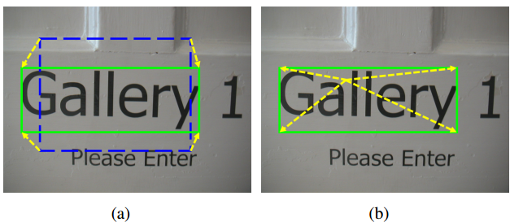

# ChengLin Liu_ICCV2017_Deep Direct Regression for Multi-Oriented Scene Text Detection

## 作者    

## 关键词

文字检测、多方向、直接回归、4个点、one-stage

## 方法亮点

- 第一次提出Direct Regression这个概念
- 提出用Scale & shift方案来降低坐标位置学习的难度

## 方法概述

本文方法首次提出直接回归的概念，用自己搭建的FPN网络结构，直接学习四个点相对于中心点（feature map上的某个点）的偏移量，并用Scale & shift方案来缩小要学习目标的值范围。

##### 方法框架流程

## 方法细节

##### Direct Regression概念

Faster R-CNN、SSD这种需要用anchor进行参考，学习的是目标和groundTruth参数分别相对于anchor的偏移量，这种方法称为不直接回归。直接回归指的是直接学习目标和groundTruth参数的偏移量，而不利用anchor作为中间桥梁。

Figure 1. Visualized explanation of indirect and direct regression. The solid green lines are boundaries of text “Gallery”, the dash blue lines are boundaries of text proposal, and the dashed yellow vectors are the ground truths of regression task. (a) The indirect regression predicts the offsets from a proposal. (b) The direct regression predicts the offsets from a point.    

##### 网络结构

自己设计的网络结构。

##### anchor方案针对长条形斜文字的问题

Figure 2. Illustration for the deficiency of anchor mechanism in detecting long and heavily inclined text words or lines. The solid yellow lines are boundaries of the text line and the dashed lines are boundaries of anchors. There is no anchor that has sufficient overlap with the text line in this image.    

##### 分类损失

##### 分类损失

+ Scale & shift

  之所以采用这个方式是因为假设文字大小少于400。因此，本来要学习的z范围是0~400，但通过这种scale and shift之后要学习的目标范围变成了0~1，更易于回归（类似于一个normalize的过程）。

  

+ smooth-L1损失

  

##### Recalled Non-Maximum Suppression

+ 思路： 先用正常NMS，然后分数低的框都往分数最高的框那边移动（有overlap的情况下），最后再合并相近的框

  

##### GroundTruth生成

把距离文字中心线上像素距离为r的点为正样本，其他文字区域内的部分置位"NOT CARE"。对于某些偏小的文字或者是偏大的文字，都设为"NOT CARE"。之所以这样设计是因为减少text和non-text之间的confusion。

Figure 5. Visualized ground truths of multi-task. (a) The left map is the ground truth for classification task, where the yellow regions are positive, enclosed by “NOT CARE” regions colored in light sea-green. The right map is the ground truth of “top-left” channel for regression task. Values grow smaller from left to right within a word region as pixels are farther from the top left corner. (b) The corresponding input image of the ground truths.

##### 其他细节点

- 数据扩增：样本随机旋转0，90，180，270度
- 网络的定位损失权重先减少后增加（The network should learn what the text is first and then learn to localize the text ）

## 实验结果

- ICDAR15

- MSRA-TD500

- ICDAR2013

## 总结与收获

这篇文章是第一次提出直接回归的概念，对后来有些文章的思想还是比较有启发性的。

