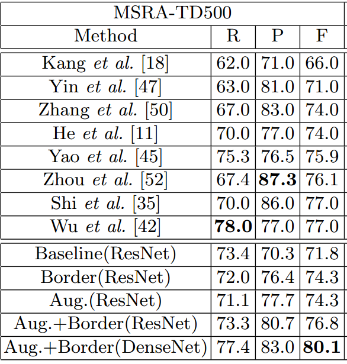

# Chuhui Xue_ECCV2018_Accurate Scene Text Detection through Border Semantics Awareness and Bootstrapping

## 作者和代码    

## 关键词

文字检测、多方向、FCN、$$xywh\theta$$、multi-stage、border

## 方法亮点

+ 采用Bootstrapping进行数据扩增
+ 增加border-loss

## 方法概述

本文方法是直接回归的方法，除了学习text/non-text分类任务，四个点到边界的回归任务（类似EAST），还增加了四条边界的border学习任务，最后输出不是直接用prediction的bounding box，而是用了text score map和四个border map来获得textline。

## 方法细节

##### bootstrapping样本扩增

简单说其实就是对文字的polygon做一些重复局部采样，丰富文字patch的多样性。

 Fig. 2: Illustration of the bootstrapping based scene text sampling: Given an image with a text line as annotated by the green box, three example text line segments are extracted as highlighted by red boxes where the centers of the sampling windows are taken randomly along the center line of the text line (the shrunk part in yellow color). The rest text regions outside of the sampling windows are filled by inpainting.

具体步骤：

+ 确定中心线，进行shrink 0.1L'
+ 沿中心线随机均匀采样点（确定框中心）
+ 确定框大小（H = 0.9H'，W 从[0.2L'，2$$d_{min}$$]选取随机值。$$d_{min}$$表示中心点到两条短边的距离的最小值）
+ 把处在原文字框内，但在采样框外（上图的绿色框内红色框外）的部分都进行inpainting（涂抹成单色），以此得到新的训练图和text的groundTruth

是否有进行bootstrapping的效果图如下：

作者认为，进行augmentation之后，feature map上特征更具有一致性，所以distance map更加平滑。

It can be seen that the inclusion of the augmented images helps to produce more consistent text feature maps as well as smoother geometrical distance maps (for regression of text boxes) which leads to more complete instead of broken scene text detections.    

我的理解是，一段很长的文本，处在不同段的文字appearance特征可能很不一样。例如Fig 2中有的地方光很强，有的地方光照很弱，因此，bootstrapping采样的是某个文字的segment，越短则这段text的特征越一致，特征学习就会越concentrate在更一致的区域上（其实是把一个学习问题难度降低了）

Fig. 3: The inclusion of augmented images improves the scene text detection: With the inclusion of the augmented images in training, more consistent text feature maps and more complete scene text detections are produced as shown in (d) and (e), as compared with those produced by the baseline model (trained using original training images only) shown in (b) and (c). The coloring in the text feature maps shows the distance information predicted by regressor (blue denotes short distances and red denotes long distance).    

##### 增加四个border-pixel的classification

增加4个要学习的border/non-border的classification map。

Fig. 4: Semantics-aware text border detection: Four text border segments are automatically extracted for each text annotation box including a pair of shortedge text border segments in yellow and red colors and a pair of long-edge text border segments in green and blue colors. The four types of text border segments are treated as four types of objects and used to train deep network models, and the trained model is capable of detecting the four types of text border segments as illustrated in Fig. 5c.    

具体的四个border的大小如下。上下取0.2H'，左右取0.8H'，比较特别的是左右的宽度取得比较大，是H'。主要是担心同一文本行文字黏连问题比较多，而且不像上下border具有很长的边（面积大一些）。上下边界主要为了解决多行文字黏连问题。border要学习的是从text到background的transition（...the extracted text border segments capture the transition from text to background or vice versa...）。

作者认为增加短的border之所以可以提升效果是因为处在文字中心部分的像素离两条短边比较远（长条文字），容易产生回归误差，导致检测结果不精确，而增加border像素的loss可以帮助解决这个问题。另一方面，增加两条长border的目的是为了解决挨的比较近的上下两行文本行的黏连问题。

The reason is that text pixels around the middle of texts are far from the text box vertices for long words or text lines which can easily introduce regression errors and lead to inaccurate localization as illustrated in Fig. 5b. At the other end, the long text border segments also help for better scene text detection performance. In particular, the long text border segments can be exploited to separate text lines when neighboring text lines are close to each other.

是否增加border的效果对比如下图：

Fig. 5: The use of semantics-aware text borders improves scene text detection: With the identified text border semantics information as illustrated in (c), scene texts can be localized much more accurately as illustrated in (d) as compared with the detections without using the border semantics information as illustrated in (b). Green boxes give correct detections and red boxes give false detections.

##### 损失函数

+ 总的损失

+ 分类损失：采用DIces Coefficient损失（confidence score of each pixel being a text pixel ）

+ 回归损失：采用IOU损失（distances from each pixel to four sides of text boundaries）
+ 边界损失：采用DIces Coefficient损失（confidence score of each pixel being a border pixel）

##### 后处理文本线形成算法

+ 二值化五个map（1个text region map，4个text border map）：采用mean_score
+ 算出region map和4个border map的overlap
+ 提取文本行（上下边）
+ 提取左右边界
+ merge四个边界组成的boungding box
+ NMS

## 实验结果

- ICDAR2013

- MSRA-TD500

- ICDAR2017-RCTW

- ICDAR2017-MLT

## 总结与收获

这篇方法的bootstrap来扩增样本的方式很有意思，虽然是在目标检测领域里早有人这么用了，但这是第一次引入到OCR。另外，增加border loss的思路也很直接，与Yue Wu_ICCV2017_Self-Organized Text Detection With Minimal Post-Processing via Border Learning的border有点像。

