# Cong_Yao_CVPR2017_EAST_An_Efficient_and_Accurate_Scene_Text_Detector

## 作者和代码

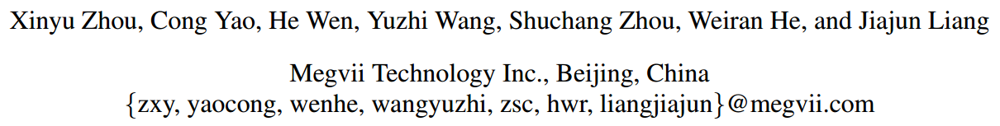

[非官方版tensorflow实现](https://github.com/argman/EAST)

[非官方版keras实现](https://github.com/kurapan/EAST)

[支持长文本检测的keras改进版实现](https://github.com/huoyijie/AdvancedEAST)

## 方法流程

该方法利用多层卷积神经网络提取图像特征，再利用该特征分别进行两个任务，像素点的分类，以及对应像素点的框的回归。最后将两个任务结果结合起来，并用非极大值抑制NMS来得到最终检测结果。 

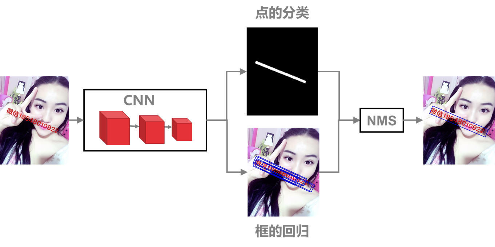

## GroundTruth生成

点的分类任务，实际上是一个图像分割的任务。训练的时候，文字区域所在部分表示1，非文字的背景部分表示0，这样就能得到分类任务的groundTruth。为了对边界像素点可以更好的分类，这个方法对原有的检测框做了一点收缩，如图中黄色虚线框收缩成绿色框，这样边界像素点可以分类得更准确。

对于框的回归，首先需要确定的是如何来表示一个框。该方法提出了两种方式，一种是用四边形的4个顶点，每个顶点有x和y两个坐标，故8个坐标来表示，称为QUAD。这种表示方式模型的学习难度比较大。下面我们详细解说第二种表示方式RBOX。我们知道，对于任意一个固定点，如果确定该点到四条边的距离，那么就可以确定一个矩形框。如果再加上角度信息，那么这五个参数d1,d2,d3,d4,以及theta就能唯一确定一个带角度的矩形框。该方法正是采用这个方式得到框回归的GroundTruth。比如图中d图表示每个点的四个距离，e图表示对应的angle。 

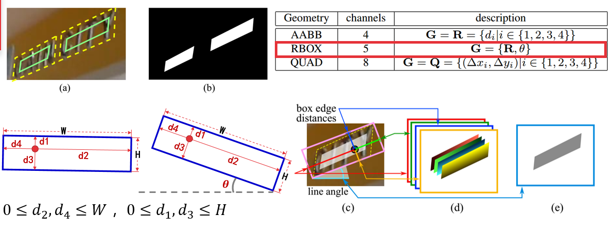

## 网络结构

该网络结构分为三部分，

第一部分是基础卷积神经网络模块，用来提取图像特征，由PVANet加4个conv stage组成；

第二部分是特征融合模块，采用类似于FPN的侧边连接方式来逐步将高层特征与低层特征进行融合；

第三部分是预测层，包括三个部分，一个是一通道的分类任务输出score map，另两个分别表示检测框。采用RBOX有5个通道，分别对应我们前面提到的d1,d2,d3,d4和角度theta。采用QUAD则表示采用4个点8个坐标来表示四边形，有八个通道。

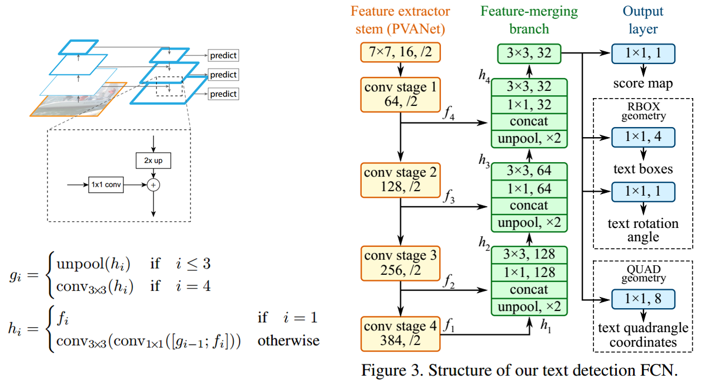

## 损失函数

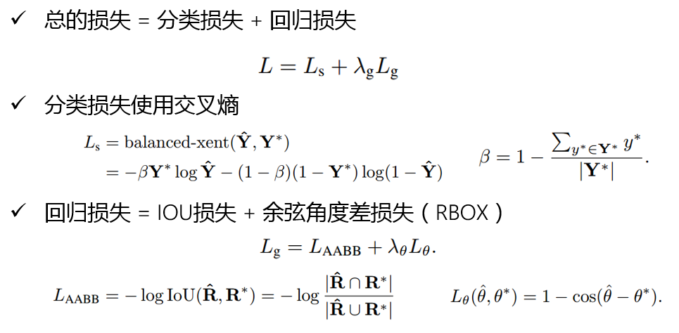

## 安装

tensorflow（>1.0） + 一些python工具包（requirements.txt）

```sh
pip install tensorflow
pip install -r requirements.txt
```

## 运行测试Demo

```shell
python ./eval.py \
    --test_data_path=./test_images/ \
    --gpu_list=0 \
    --checkpoint_path=./models/ \
    --output_dir=./results/
```

## 准备训练数据

##### 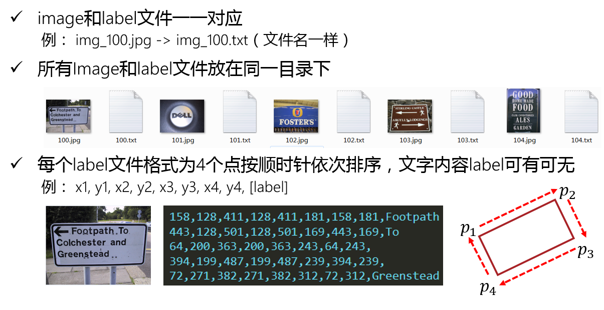

## 训练流程

- Step1. 准备训练数据
- Step2. [下载Resnet预训练模型](http://download.tensorflow.org/models/resnet_v1_50_2016_08_28.tar.gz)
- Step3. 修改训练参数，进行训练

```shell
python multigpu_train.py \
    --gpu_list=2,3 \
    --input_size=512 \
    --batch_size_per_gpu=16 \
    --checkpoint_path=./models/ICDAR15_512/ \
    --text_scale=512 \
    --training_data_path=./datasets/ICDAR15_train/ \
    --geometry=RBOX \
    --learning_rate=0.0001 \
    --num_readers=24 \
    --pretrained_model_path=./models/pretrained/resnet_v1_50.ckpt
```

## 代码分析和解读

##### 关键代码文件说明

| 文件名                     | 文件功能/函数说明                                 |
| -------------------------- | ------------------------------------------------- |
| data_util.py               | 训练数据generator类封装（与数据并行、多线程相关） |
| eval.py                    | 测试函数                                          |
| model.py                   | 整个网络结构搭建、损失函数实现                    |
| icdar.py                   | 训练GroundTruth生成、数据处理、大部分工具函数实现 |
| multigpu_train.py          | 训练函数（主要涉及与tf相关的训练框架）            |
| nets/                      | 包括resnet相关的网络结构搭建                      |
| lanms/和local_aware_nms.py | 与NMS相关的python函数、CPP源函数及编译相关        |

#####  代码分析和解读

+ model.py（ model）

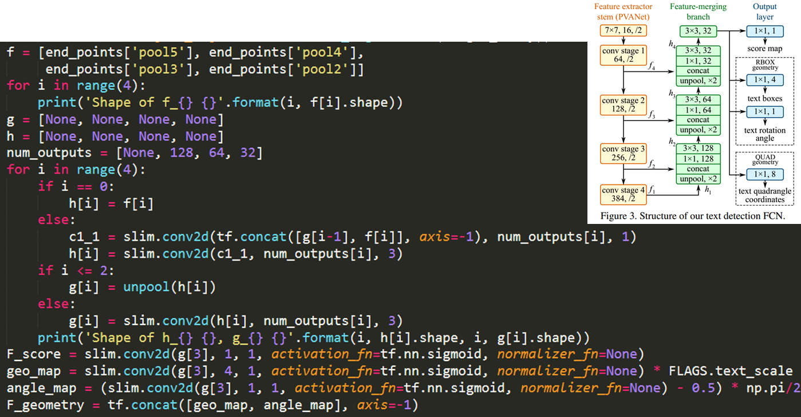

+ model.py （loss）

  模型部分，除了结构，损失函数的实现也很重要。分类损失没有按照论文所说的交叉熵，而是使用了更简单的dice损失。代码和公式里的L_AABB是IOU的log损失。这边两个矩形框相交面积的计算，没有采用复杂的计算方式，而是直接用了简化的近似计算方式。该假设把交集部分近似为一个矩形，然后把点到相对的两条边的距离相加来计算矩形的宽和高，并用宽和高直接相乘来算相交面积。这个方法计算简单，实际是不太精确的，因为相交部分不一定是矩形，有可能是任意四边形，那么该计算方式就不是非常合理。可以把这部分代码换成自己的方法实现。 

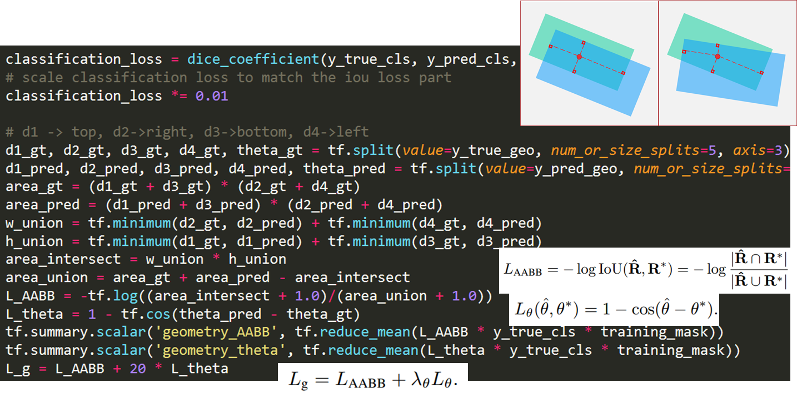

+ icdar.py（generate_rbox）

  generate_rbox这个函数，对于整个训练数据生成非常重要。它的功能是把一个任意四边形转成包含四个顶点的最小外接矩形。该方法首先是以四边形的任意两个相邻的边为基础，求出包含四个顶点的最小平行四边形，总共有4个，然后选择面积最小的平行四边形，将其转换为矩形。如图中所示。灰色是初始的四边形，红色为对应的平行四边形，黄色是最后输出的矩形。这里的关键是第一步如何根据相邻两边来确定平行四边形。

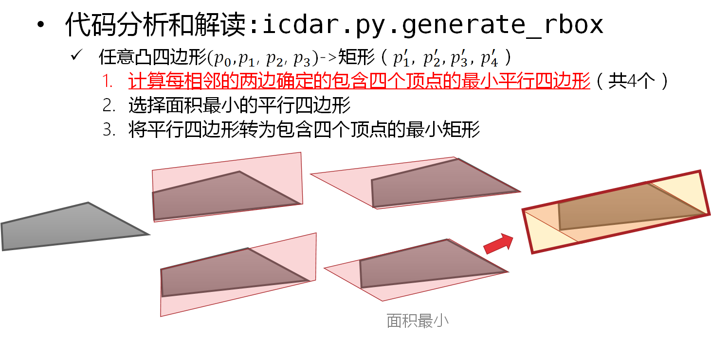

+ 单个平行四边形生成

这里我们假设要求的是以边（p0, p1）和边（p1, p2）作为参考边的平行四边形。边（p0, p1）设为edge，边（p1, p2）设为forward_edge，边p0和p3设为backward_edge。首先第一步，先求出点p2和p3到边edge的距离，求出比较大的那个点，图中p2距离更远，因此选择p2。然后过点p2做一条平行于边edge的直线，该边我们定义为edge_opposite。现在，我们就有了平行四边形的三条边，接下来了来画最后一条边。采用同样的方法对比点p0和p3到直线forward_edge的距离，选择距离更远的点，图中是p3，然后过点p3做直线平行于forward_edge，最后这条直线称为forward_opposite。到这里，四条边都画出来了，分别是edge，forward_edge，edge_opposite，和forward_opposite，最后根据直线的交点更新4个顶点位置。

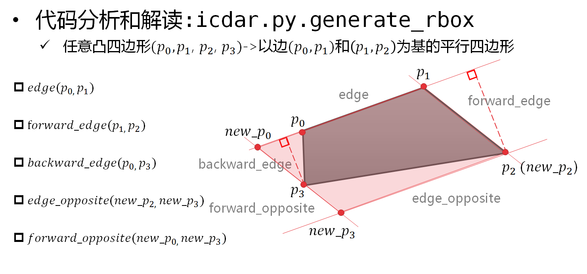

+ 对应代码说明

  这里点、边的定义和刚才图中讲解的是一一对应的。Fit_line函数表示根据两点求直线，point_dist_to_line表示的是点到直线的距离。这个if条件判断的就是点p2还是p3到边（p0, p1）的距离哪个更大，然后取更大的点，过该点画平行直线，即为edge_opposite。 

  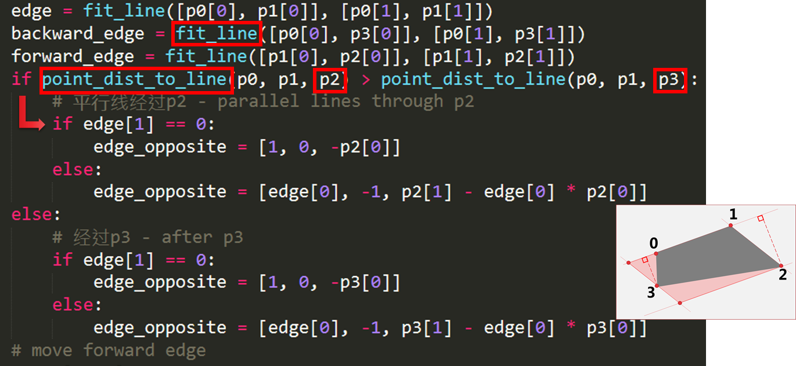

  这个介绍的是刚才画最后一条边的方法。同样是判断点p0和点p3到边（p1，p2）的距离，取大的那个点，图中是p3，过p3画平行于边（p1，p2）的直线，最后根据直线的交点更新p0和p3，最终新的p0，p1，p2，和p3形成了最后的平行四边形。

  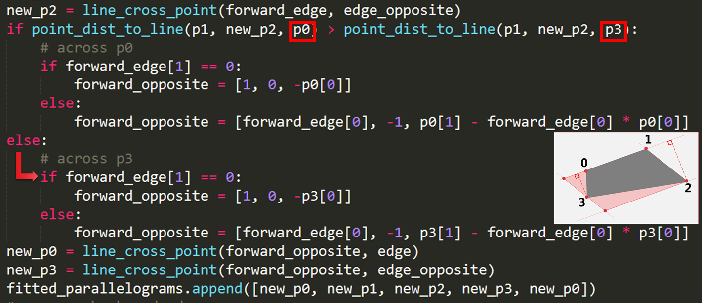

## 方法亮点

- 提出一种新的框的表示方式（4个d+1个angle），并且对应的IOU Loss和角度的cos Loss
- 属于一种direct regression，没有anchor，而且是one-stage的方法，训练方便
- groundTruth的shrink方式也比较特别，对于边界像素学习更容易

## 实验结果

- ICDAR2015

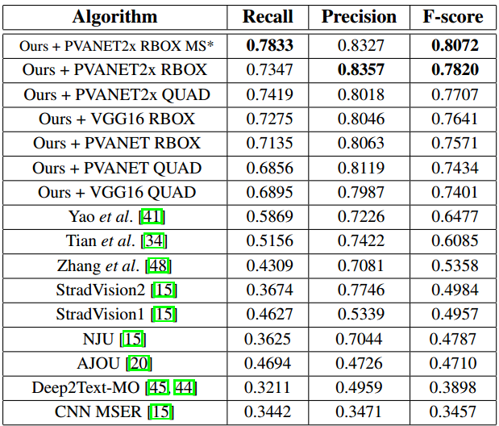

- COCO-Text

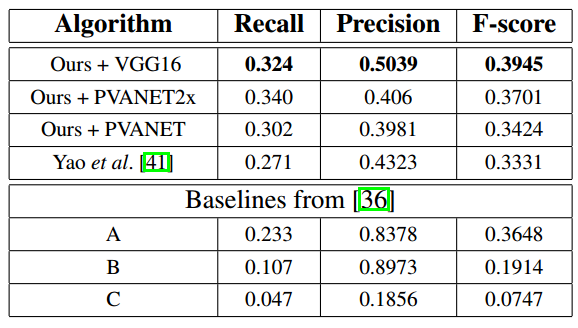

- MSRA-TD500

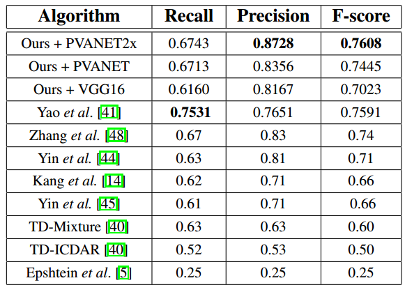

- 速度

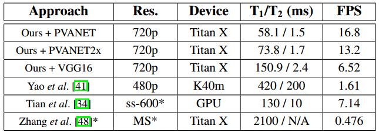

## 总结与收获

该方法因为比较早“开源”，所以用的人比较多。很多东西比如关于框的表示方式(4个d+1个angle)，IOU-Loss以及cos-Loss对后来的方法都有借鉴和参考意义。


