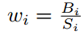

# Dan Deng——【AAAI2018】PixelLink_Detecting Scene Text via Instance Segmentation

## 作者和代码    

[tensorflow代码](https://github.com/ZJULearning/pixel_link)

## 关键词

文字检测、多方向、直接回归、$$xywh\theta$$、one-stage、开源

## 方法亮点

- 使用instance segmentation的思路做（利用了二类分类+每个像素点与周围8个顶点的link分类）
- 利用图像处理方法进行后处理，不需要用NMS

## 方法概述

本文方法采用instance segmentation思路，预测text/non-text和pixel-link关系，再使用简单的图像处理的方式进行后处理来去除噪声。

## 方法细节

##### 方法流程图

##### 网络结构

##### Link定义

+ 两个像素的都是positive（text）-> link是positive
+ 一个是text，一个是non-text -> link是positive
+ 两个都是non-text -> link是negative

##### 损失函数

+ 总损失

+ pixel 损失（Instance-Balanced Cross-Entropy Loss）

  利用每个instance的面积来对其loss进行加权，目的是为了提高小目标对loss的贡献。

  

  

  

+ link损失

  link_CE是Cross-Entropy loss。

##### 后处理

+ 通过pixel信息来链接Text/non-text prediction的score map里的像素，得到instance segmentation map
+ 利用OpenCV的minAreaRect来提取oriented rectangle
+ 使用后处理过滤噪声
  + 去掉短边小于10个像素的box
  + 去掉面积小于300的box
  + 其他利用长宽比等（参数设置为在训练集上做统计，利用百分比对应的值作为参数，例如99%以上的文字短边都大于10,）

## 实验结果

- ICDAR2015

- MSRA-TD500

- ICDAR2013

- 模型分析对比实验

  

  

## 总结与收获

这篇方法采用纯分割的思路，完全没有利用目标检测的方法，连后处理都没用nms，方法还是比较特别的。

