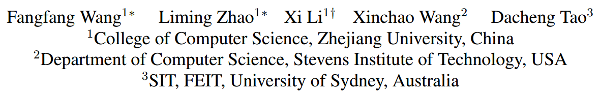
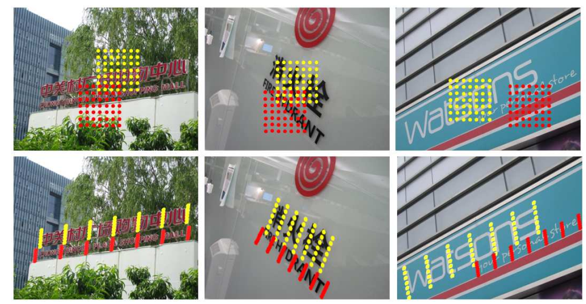
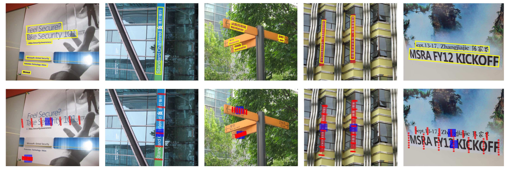
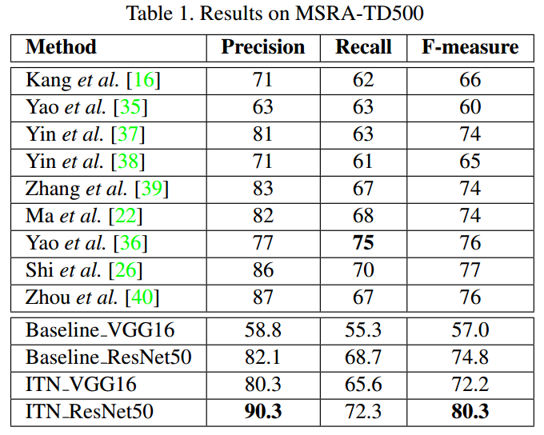
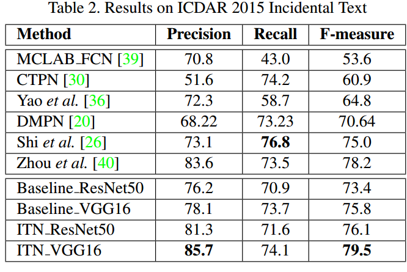
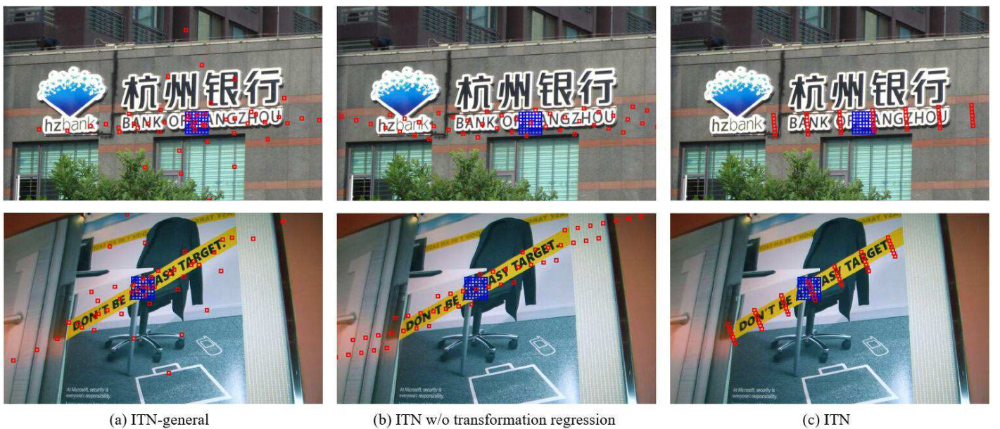

# Fangfang Wang_CVPR2018_Geometry-Aware Scene Text Detection With Instance Transformation Network

## 作者和代码    

[caffe代码](https://github.com/zlmzju/itn)

## 关键词

文字检测、多方向、直接回归、四个点、one-stage、开源

## 方法亮点

这篇ITN方法，是利用了可变性卷积网络来做倾斜文本检测。利用增加一个可变性卷积分支去学习文字的变换参数，然后将变换参数应用到原来的结果中

直观来看，就是下图中把方形的网格拉成这种覆盖文字目标的长条形网格（仿射变换）。

## 方法概述

本文方法是对TextBoxes（水平文字检测）进行改进，用于**多方向文字检测**。和SSD一样，该方法是one-stage的

## 方法细节

##### 网络结构

##### 其他

## 实验结果

- MSRA-TD500

Figure 4. Examples on MSRA-TD500. The first row shows detection results (yellow bounding-boxes) of the ITN. The second row shows the regular sampling grids (blue) and the adaptive sampling grids (red) on the feature maps (visualized as input images). For clarity, we draw two pairs of sampling grid examples on one image at most.    

- ICDAR2015

- 和不同可变性卷积网络对比

Figure 6. Example of the learnt transformations. Transformed sampling grids (red) and corresponding regular sampling grids (blue) on feature maps (visualized as input images) of (a) ITN-general, (b) ITN w/o transformation regression and (c) ITN.

- 

## 总结与收获

这篇方法主要是利用了可变性卷积网络，特点是把transformation的参数设定为仿射变换，这样大大降低了transformation的参数和学习难度。因为原来的可变性网络是没有任何约束条件的，形变是任意的，学习难度比较大，所以这篇文章把这种形变限制为仿射变换，降低了学习的难度，更加实用于文字检测。该方法可以用在倾斜文本检测上，但无法用在曲线文本检测上，除非找到一种更适合曲线文本的transformation。另外，文章没提到速度，应该是比较慢的。

