# Han Hu——【ICCV2017】WordSup_Exploiting Word Annotations for Character based Text Detection

## 作者和代码    

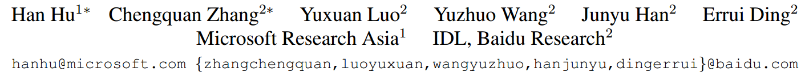

[caffe检测torch7识别代码](https://github.com/MhLiao/TextBoxes_plusplus)

## 关键词

文字检测、多方向、直接回归、$$xywh\theta$$ 、multi-stage、监督学习

## 方法亮点

- 采用单词、文本行的标注信息进行监督学习来辅助字符检测
- 在ICDAR2013数据集上F值90+，后来的方法能超过这篇文章的寥寥无几

## 方法概述

利用Faster RCNN或SSD等目标检测框架检测单个字符，并利用单词、文本行的标注信息进行监督学习来辅助字符检测器的训练（字符模型和mask进行交替训练），最后采用图模型来进行文本行合并、LSTM空格检测来进行单词切割等后处理。

##### 文章出发点

各式各样的文字（中英、曲线文本、公式）等排列布局不同，但最小单元都是字符。所以，检测字符具有通用性。但目前有字符的标注数据集太少了，大部分都是以单词、文本行的方式标注的。故这篇文章想要利用这些单词、文本行的标注来帮助字符检测。主要是利用了已标注信息进行监督训练。

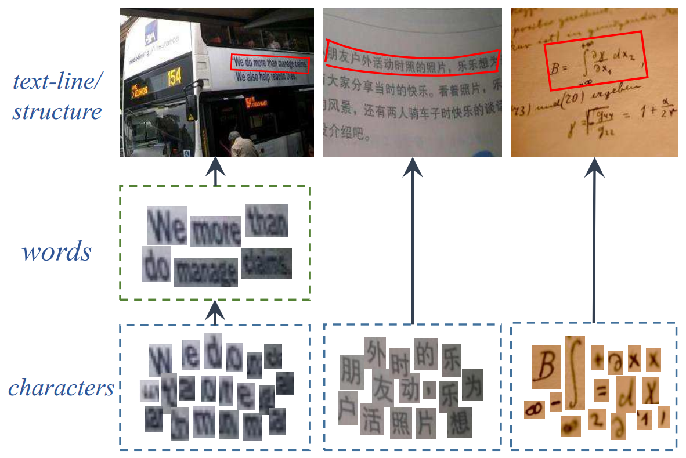

Figure 1: The visual hierarchies for various language texts under different scenarios. Different languages and scenarios may differ in hierarchy, but they are all formed by a basic element, character    

##### 检测流程

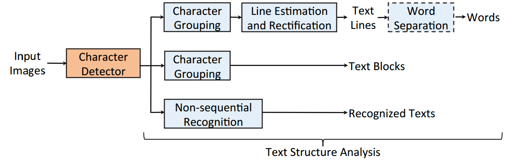

Figure 3: Our pipeline. There are two modules, character detector and text structure analysis. The pipeline is flexible for various scenarios ascribed to the atomicity and universality of characters.    

## 方法细节

##### character detector

利用Faster RCNN或者SSD等就可以。进行的修改包括：

+ 因为字符很小，所以进行predition的feature map采用更底层higher resolution的feature map(1/4大小)
+ 采用了hard patch mining方案来解决背景干扰问题。每1万次iteration后把false positives加大权重；

##### detecotr网络结构

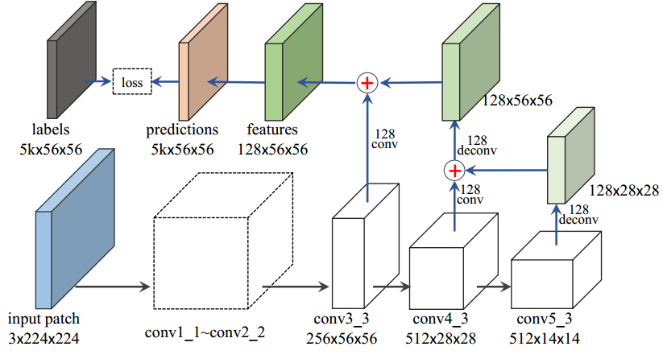

Figure 4: Our basic detection network. The network inherits from the VGG16 network model [36].

##### 字符模型训练

采用update mask和update network交替的方式进行训练。

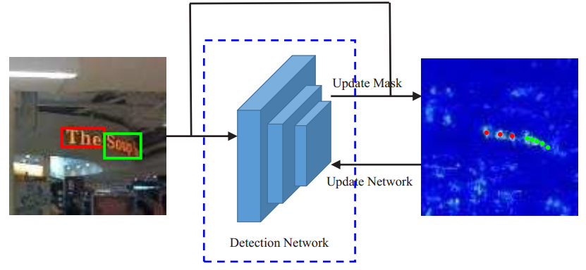

Figure 2: Illustration of our word supervision training approach for a character model. Two alternative steps are conducted: giving the current model, compute a response map which is then used together with word annotations to get a character center mask (red and green points); giving the character center mask, supervise the training of character model.    

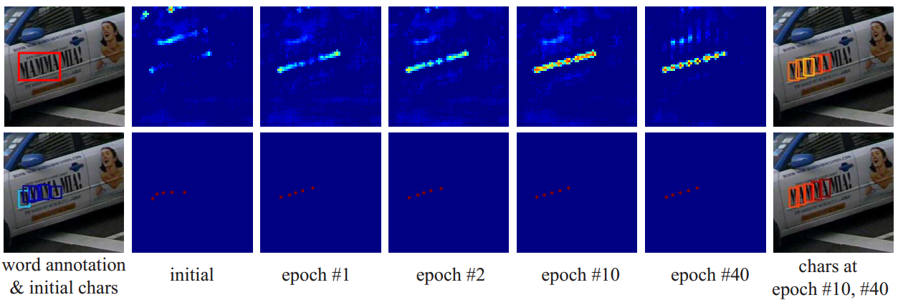

Figure 5: Updated character responses and the corresponding character masks during word supervised training on ICDAR15 datasets. The initial model in the second column is trained by 5k warmup iterations on synthetic data alone. The 3 ∼ 6th columns are responses during the word supervised training, where the epoch number means for ICDAR15 datasets. For illustration, we use bounding box annotations rather than the original quadrangles in training. Both the responses and character candidates are colored by their scores (indexed by colormap in Matlab)    

+ 如何更新character mask？

  给定word box和character response map，确定character位置和大小： 通过最大生成树算法最大化公式(1)来选择字符集合。

  Bchars和Banno分别是选择的字符和单词的bounding box。$$\lambda_1和\lambda_2$$分别表示协方差矩阵C（字符的点坐标）的第一大和第二大的特征根。$$s_1$$倾向于找到bounding box里coverage更大的字符，$$s_2$$倾向于找到同一行直线的字符；

  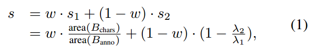

+ 如何更新模型？

  利用公式(1)得到的分数来更新loss。

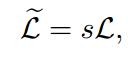

##### 字符结构分析

+ 字符合并

  采用Text-flow图最小费用流的方式来合并字符。只是将原本只能处理水平的改为可以处理倾斜文本。原来图上一个节点表示一个字符（character-pairs：分数高、距离近、尺度相近），现在一个节点表示两个靠得比较近的字符。采用这种方式之后，可以定义更高阶的cost。例如角度差（两条节点的角度差就是两条直线的角度差）。最后还是采用最小费用流算法来求最优文本线集合。

+ 文本线模型估计和矫正

  + 文本线估计： 0阶-水平和竖直，1阶-倾斜文本，2阶-任意多边形piecewise linear model。
  + 模型矫正：TPS进行矫正

+ 单词切割

  + LSTM-based word blank detection方法

## 实验结果

- 各大数据集的数据标注信息统计

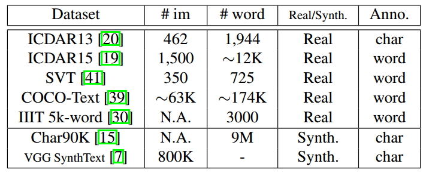

- Faster RCNN和SSD的对比

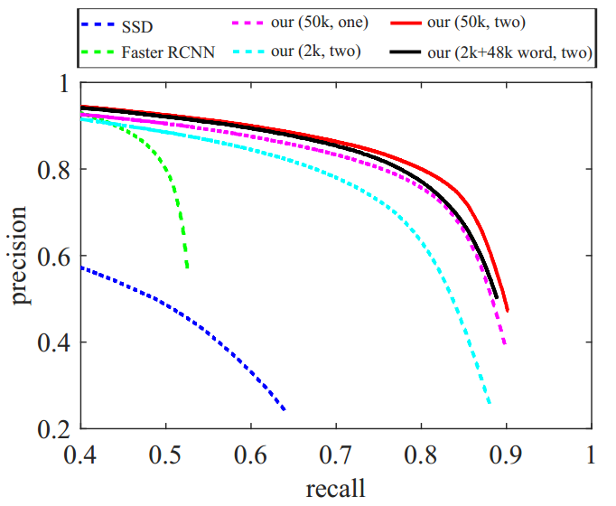

Figure 6: Character detection performance of our basic detection network, the faster RCNN and SSD methods on the VGG SynthText-part datasets. Four variants of our method are presented. The first term in brackets indicates the used supervision source. The second term indicates the used hard negative mining strategy, with “one” representing one-level hard negative mining and “two” representing two-level hard negative mining.

- ICDAR2013(Detval)

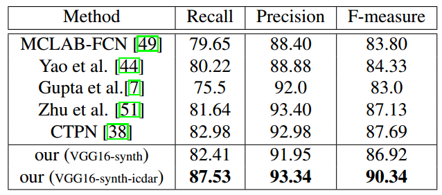

- ICDAR2015

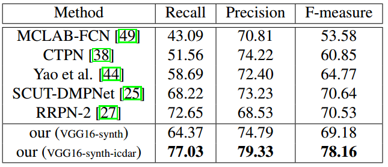

+ 其他复杂场景（曲文、公式等）

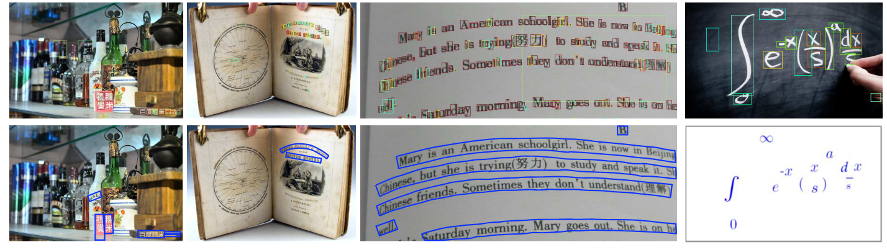

Figure 8: Applied to various scenarios. The top row shows detected characters, with colors indicating character scores (indexed by colormap in Matlab). The bottom row shows results of structure analysis.    

## 总结与收获

这篇方法和WeText的思路一致，利用word和textline的annotation来监督训练字符级detector。不一样的地方在于训练方式是mask和model交替训练。而且明显后处理比WeText更工程化的多，不但处理水平也能处理倾斜、曲文。关键是最后ICDAR2013的结果真的太好了，所以后来有的文章argue说是因为利用了更多的监督信息（字符比文本线等信息更多）。

