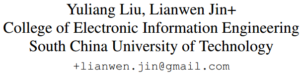
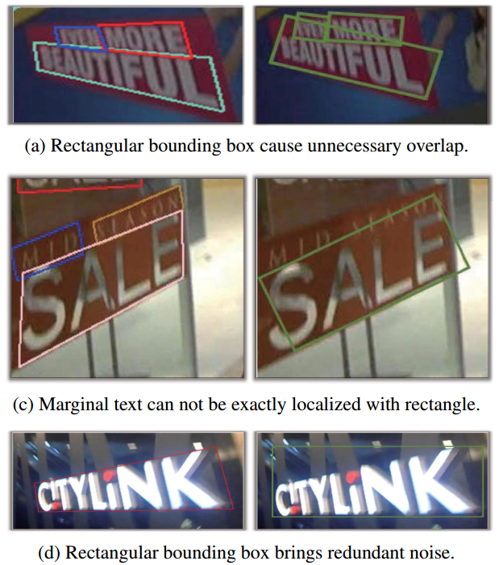
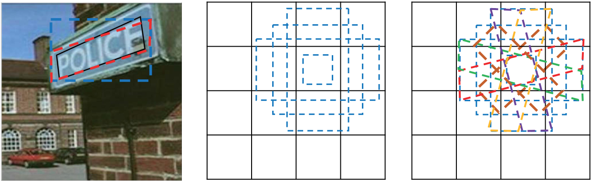
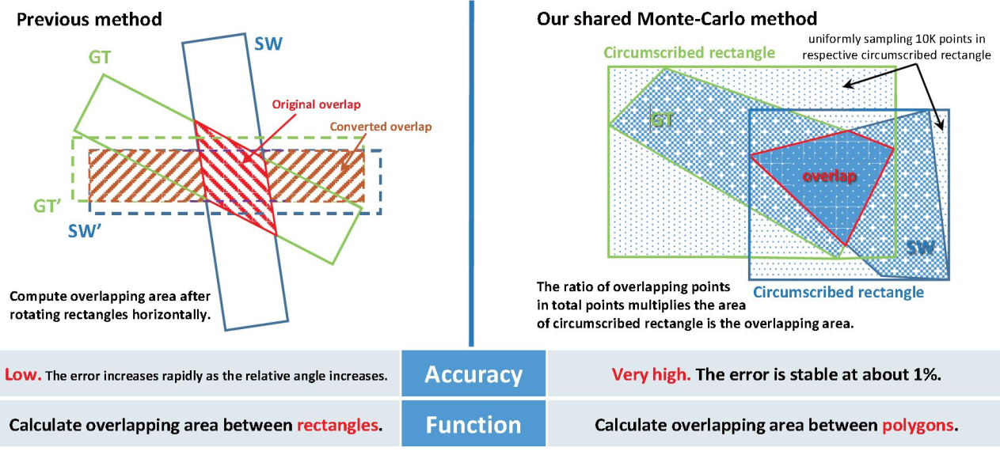
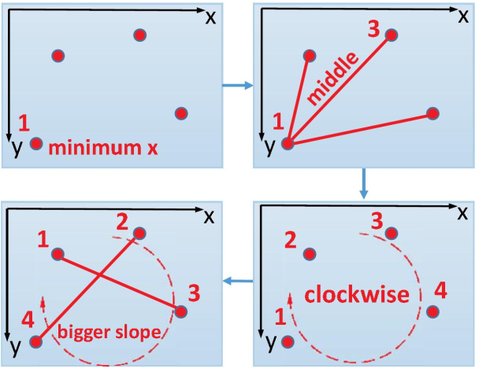
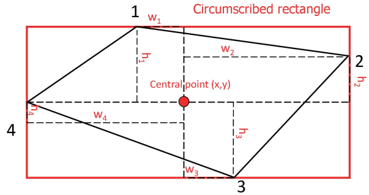
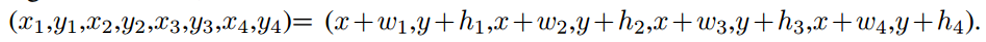
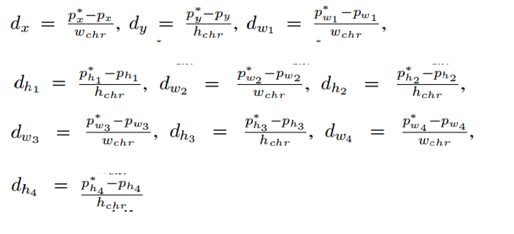
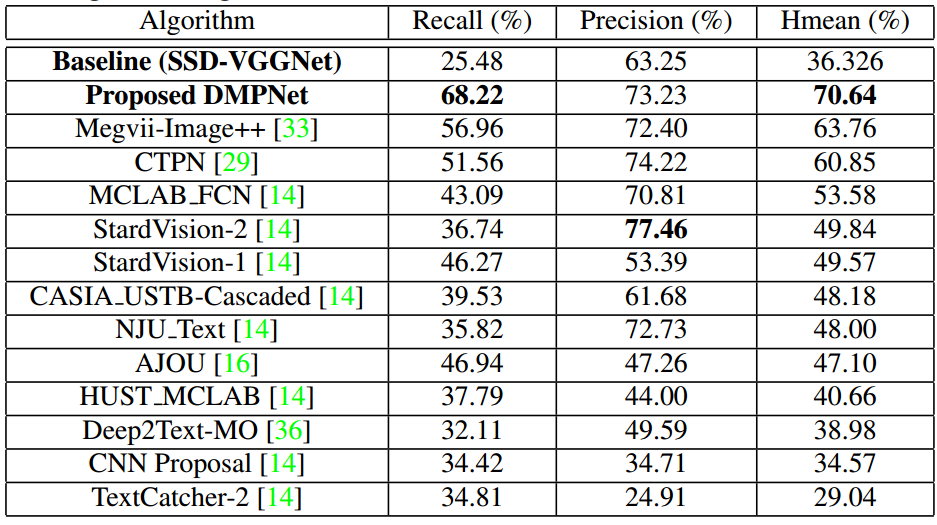

# Lianwen Jin_CVPR2017_Deep Matching Prior Network_Toward Tighter Multi-oriented Text Detection

## 作者    

## 关键词

文字检测，多方向，SSD，四个点，one-stage

## 方法亮点

- 首先提出（并成功学习）用四个点的多边形来表示文字
- 用旋转anchor来解决倾斜文字检测问题
- 计算四边形的IOU方式（蒙特卡罗法）

## 方法概述

本文方法是对SSD（水平文字检测）进行改进，通过学习四个点相对多方向anchor的位置信息，用于**多方向文字检测**。

## 方法细节

##### 四边形和斜矩形的不同

矩形表示的问题：

+ 矩形框覆盖
+ 边界文字
+ 引入无关信息干扰

##### 有旋转角度的anchor

Figure 2. Comparison between horizontal sliding window and quadrilateral sliding window. (a): Black bounding box represents ground truth; red represents our method. Blue represents horizontal sliding window. It can be visualized that quadrilateral window can easier recall text than rectangular window with higher overlapping area. (b): Horizontal sliding windows used in [19]. (c): Proposed quadrilateral sliding windows. Different quadrilateral sliding window can be distinguished with different color.    

##### 计算IOU的方式

##### 计算四边形四个顶点的顺序

##### 四个点的表示

利用四个点到中心点的偏移量。最终学习的是8个偏移量（四个点相对于中心点）

## 实验结果

- ICDAR15

## 总结与收获

这篇方法的四个点的表示和学习方式是比较早提出来的。旋转anchor，以及iou计算方式都比较有创新性。

