# Pan He_ICCV2017_Single Shot Text Detector With Regional Attention

## 作者和代码    

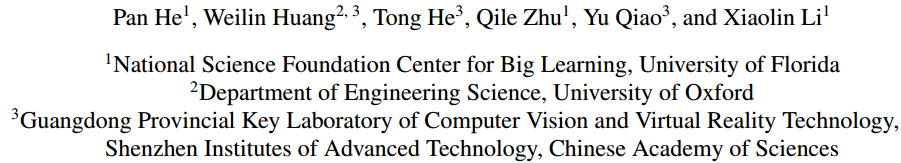

[caffe代码](https://github.com/BestSonny/SSTD)

## 关键词

文字检测、多方向、SSD、$$xywh\theta$$ 、one-stage、开源

## 方法亮点

- Attention机制强化文字特征： Text Attentional Module
- 引入Inception来增强detector对文字大小的鲁棒性：Hierarchical Inception Module（HIM）

## 方法概述

本文方法是对SSD进行改进，通过增加一个角度信息，用于**多方向文字检测**。只要通过Attention机制和引入Inception来提高对文字特征的鲁棒性。

## 方法细节

##### 网络结构

SSD的feature fusion层进行改进。增加了Text Attentional Module， Hierarchical Inception Module，以及AIF进行特征融合。

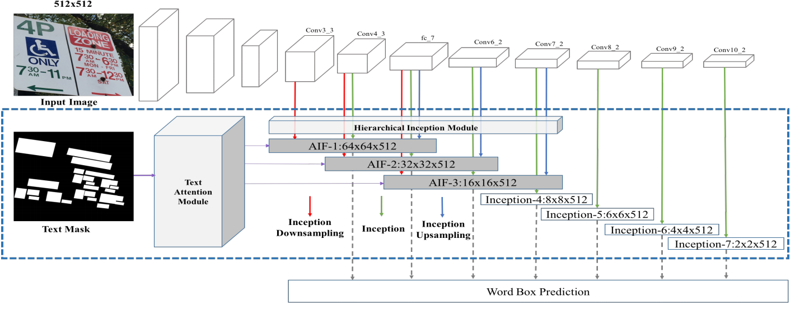

##### Aggregated Inception Features (AIFs)    

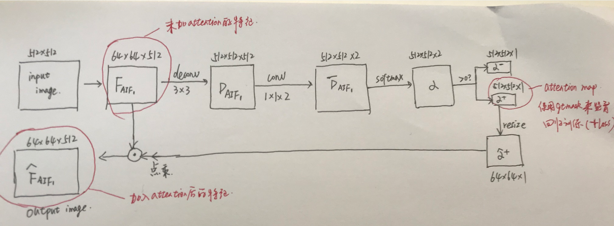

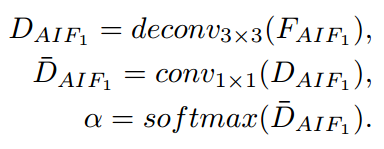

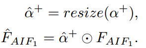

##### Text Attentional Module

Attention的思想是原来的特征可能是全局整张图的，但是通过强化文字部分的特征（增加监督信息来对text部分的特征进行加权强化），来让文字特征更明显，更利于分类和回归任务。简单说，原来可能要看完整张图来做判断，现在只要多看看文字部分。

从效果来看，attention的好处：噪声的鲁棒性更强，文字的黏连问题解决的更好。

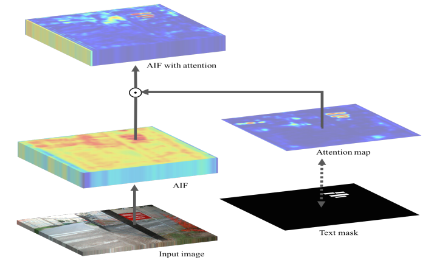

Figure 3: Text attention module. It computes a text attention map from Aggregated Inception Features (AIFs). The attention map indicates rough text regions and is further encoded into the AIFs. The attention module is trained by using a pixel-wise binary mask of text.    

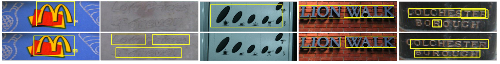

Figure 4: We compare detection results of the baseline model and the model with our text attention module (TAM), which enables the detector with stronger capability for identifying extremely challenging text with a higher word-level accuracy.    

##### Hierarchical Inception Module

Inception有多种不同感受野的特征融合，对文字的大小鲁棒性更强。

##### 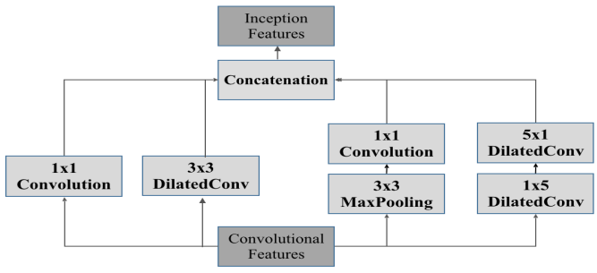

Figure 5: Inception module. The convolutional maps are processed through four different convolutional operations, with Dilated convolutions [34] applied.    

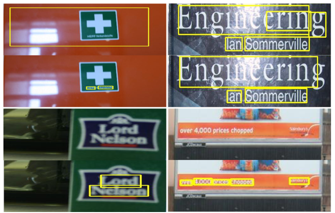

Figure 6: Comparisons of baseline model and Hierarchical Inception Module (HIM) model. The HIM allows the detector to handle extremely challenging text, and also improves word-level detection accuracy.

##### 其他细节点

- default box的aspect ratio从1,2,3,5,7 换成1,2,3,5,$\frac{1}{2}$,$\frac{1}{3}$,$\frac{1}{5}$

  

## 实验结果

- ICDAR13数据集上验证TAM（+3）、HIM（+2）、TAM+HIM（+5）的效果

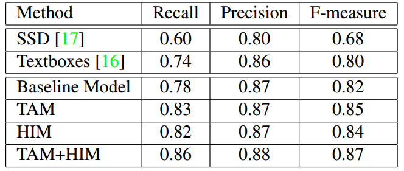

- ICDAR2013和ICDAR2015

  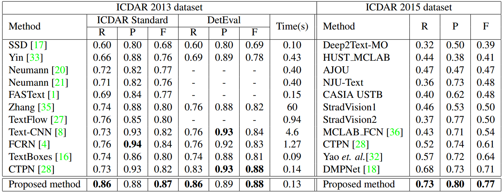

- COCO-text

  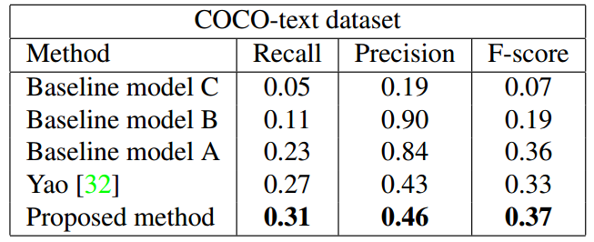

- 速度

  - TITAN X， caffe，0.13s/image

## 总结与收获

这篇文章的方法主要是修改网络模型，通过增加attention和inception来提升特征鲁棒性。这个思想可以用于任何其他目标检测框架的特征融合层。

