# Shangbang Long_ECCV2018_TextSnake_A Flexible Representation for Detecting Text of Arbitrary Shapes

## 作者    

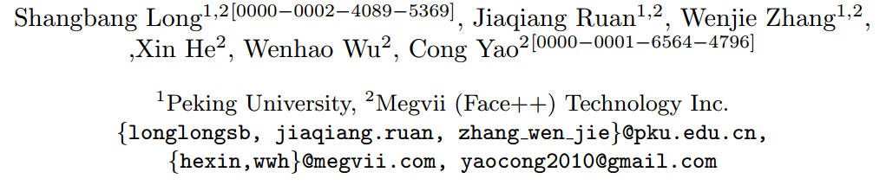

## 关键词

文字检测，曲线文本，多方向，multi-stage，圆盘表示法

## 方法亮点

- 提出一个新的曲线文本表示方法TextSnake（由圆盘序列组成）
- 提出了一个新的曲文检测方法，并且精度比之前的高40%+（Total-Text数据集）

## 方法概述

本文方法基于一个新的曲线文本表示方法TextSnake——用一个有序的圆盘序列来表示文字，先用FCN检测文本区域、文本中心线、以及每个点的圆盘半径、方向，然后利用文本区域mask和中心线mask得到text instance segmentation。在每个text-instance上，交替进行点中心化和点扩展，得到文本中心点序列。最后结合圆盘半径，得到文本区域的TextSnake表示并进行union得到最终的文本区域。

## 方法细节

##### TextSnake曲文表示方法

+ 圆盘表示法和已有的文字表示方法对比（主要是四边形）

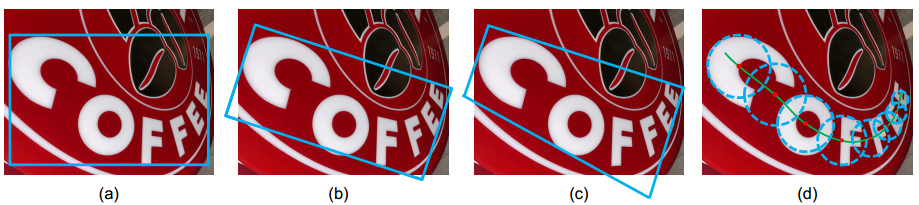

Fig. 1. Comparison of different representations for text instances. (a) Axis-aligned rectangle. (b) Rotated rectangle. (c) Quadrangle. (d) TextSnake. Obviously, the proposed TextSnake representation is able to effectively and precisely describe the geometric properties, such as location, scale, and bending of curved text with perspective distortion, while the other representations (axis-aligned rectangle, rotated rectangle or quadrangle) struggle with giving accurate predictions in such cases.    

+ 圆盘表示法

  文本区域由多个互相覆盖的、有序的圆串联而成。故文本区域可以由一个圆序列来完全表示。

  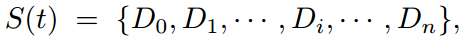

  其中$D_i$表示第i个disk，n是圆的总个数。每个$D = (c, r, \theta)$，三个参数分别表示中心点、半径，以及圆盘角度。$r$是圆盘中心点所在的局部宽度（笔画宽度）的一半。$\theta$是经过中心点的曲线的切线的角度的正切值。

  前两个很好理解，最后一个事实上，如果从直观角度，已知每个圆盘中心点坐标和半径，其实就已经确定了这个disk序列。之所以这里多加一个参数$\theta$是因为这里中心线上的点非常多（可以作为圆盘中心的），不可能每个点都求出一个圆盘（速度太慢），所以作者提出的方法是基于其中某个点来扩展下一个点。通过隔一段距离采样一个点的方式来得到整个中心文本线，而这个采样的step长度和方向就可以由$r$和$\theta$来共同决定。（个人觉得这个表示方法不太合理。即使没有$\theta$也是一个完整的表示法。$c$和$\theta$两个信息不但冗余甚至可能冲突）

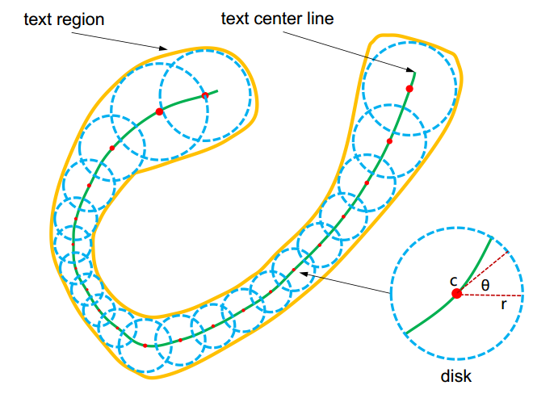

Fig. 2. Illustration of the proposed TextSnake representation. Text region (in yellow) is represented as a series of ordered disks (in blue), each of which is located at the center line (in green, a.k.a symmetric axis or skeleton) and associated with a radius r and an orientation θ. In contrast to conventional representations (e.g., axis-aligned rectangles, rotated rectangles and quadrangles), TextSnake is more flexible and general, since it can precisely describe text of different forms, regardless of shapes and lengths.    

##### 检测流程

检测步骤主要分为四个步骤。

+ 先用FCN+FPN学习5个mask（事实上TR和TCL都分别是2个channel），是否是文字的text region mask（TR），是否是文字中心线的text central line mask（TCL），以每个点为圆盘中心的圆半径mask（radius），以每个点为圆盘中心的圆角度的cos值mask（$$cos\theta$$），以每个点为圆盘中心的圆角度的sin值mask（$$sin\theta$$）
+ 利用TR和TCL得到文字的instance segmentation结果。首先用TR和TCL进行mask相乘，再采用disjoint set并查集查找算法来得到instance segmentation（直接做个简单的连通分量分析？）
+ 利用instance segmentation和前面学习到的圆盘半径$r$和$\theta$信息，对每个text-instance进行striding，获得用来表示曲文的TextSnake的圆盘中心点序列。
+ 利用圆盘中心点序列+圆盘半径信息重构文本线。（这部分文章并没有详细说明，直接用些形态学处理，比如膨胀之类的？但这样是有问题，因为按TextSnake的定义，圆盘序列应该是唯一确定一个曲文的，但用形态学处理参数不同结果也是不一样的）。

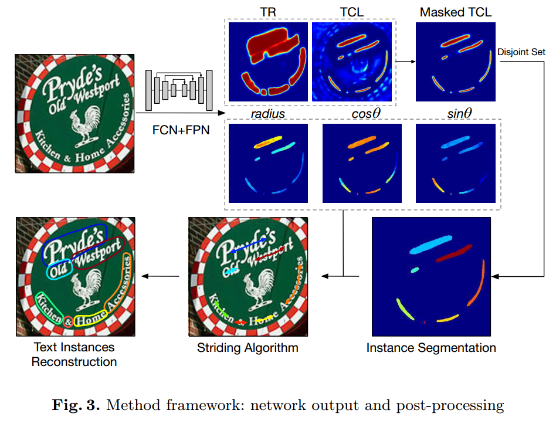

##### 网络结构

仿照FPN和U-net设计的结构如下：

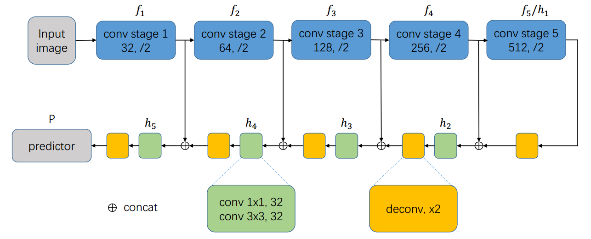

对应的操作运算公式如下：最后输出7个channel，4个channel表示logits of TR/TCL，另外3个channel对应text-instance的$$r, cos\theta， sing\theta$$。

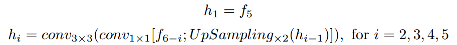

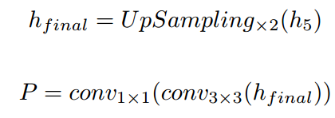

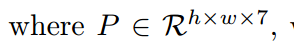

##### Post-processing算法

+ input： 每个text的instance-segmentation的mask、半径$r$的mask，角度$\theta$相关的mask（$cos\theta$

和$sin\theta$）

+ output： 曲线文字区域

+ Step1-Act(a)： 在instance-segmentation上随机取一点，将其中心化（利用法向量等将点移到过该点的笔画的中心位置），将中心化后的点作为圆盘中心线的第一个起点

+ Step2-Act(b)： 以上一个点为中心点，向两边同时扩展（或者一边）。扩展方向和step大小为与半径$r$和$\theta$相关，公式如下：

  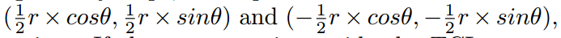

+ Step3-Act(a)：将扩展后的点进行中心化

+ Step4：重复Step2和Step3，直到整个圆盘中心线都扩展完成（超出instance-segmentation区域）

+ Step5-Act(c)： 利用中心线+半径信息，进行重构得到最终输出

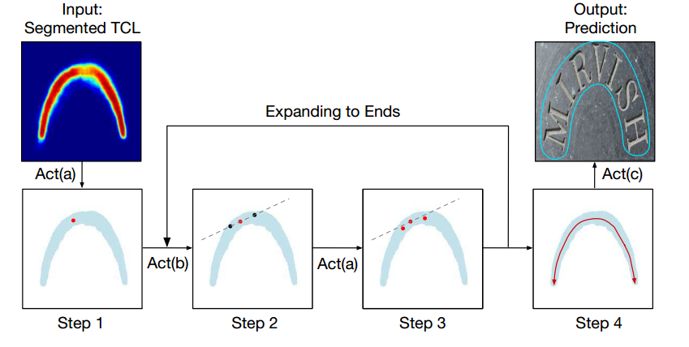

Fig. 5. Framework of Post-processing Algorithm. Act(a) Centralizing: relocate a given point to the central axis; Act(b) Striding: a directional search towards the ends of text instances; Act(c) Sliding: a reconstruction by sliding a circle along the central axis.    

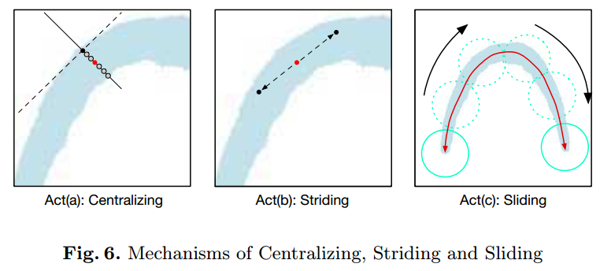

- **Act(a)** Centralizing As shown in Fig.6, given a point on the TCL, we can draw the tangent line and the normal line, respectively denoted as dotted line and solid line. This step can be done with ease using the geometry maps. The midpoint of the intersection of the normal line and the TCL area gives the centralized point.
-  **Act(b)** Striding The algorithm takes a stride to the next point to search. With the geometry maps, the displacement for each stride is computed and represented as ( 1 2 r × cosθ, 1 2 r × sinθ) and (- 1 2 r × cosθ, - 1 2 r × sinθ), respectively for the two directions. If the next step is outside the TCL area, we decrement the stride gradually until it’s inside, or it hits the ends. 
- **Act(c)** Sliding The algorithm iterates through the central axis and draw circles along it. Radii of the circles are obtained from the r map. The area covered by the circles indicates the predicted text instance. In conclusion, taking advantage of the geometry maps and the TCL that precisely describes the course of the text instance, we can go beyond detection of text and also predict their shape and course. Besides, the striding algorithm saves our method from traversing all pixels that are related.    

##### Label生成

+ 确定两个end边：（个人觉得太不严谨这么定义....有些曲文没有这种互相平行而且方向相反的边。为什么不定义为最短边+和最短边最平行或者距离最远的边？）

The two edges near the head or tail are running parallel but in opposite direction.  

+ 在每个边上撒点（均匀撒点）

+ 取相对边的中点连线即为圆盘中心线

  

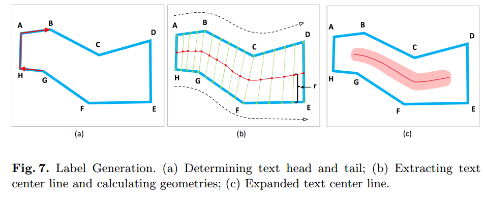

##### 损失函数

包括分类（TR和TCL）和回归（$r$、$cos\theta$、和$sin\theta$）损失。

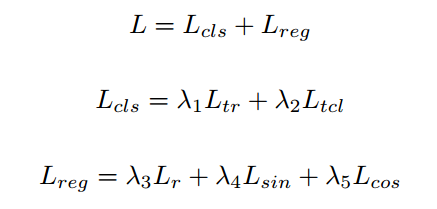

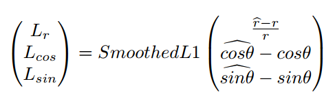

## 实验结果

- 实验结果示例

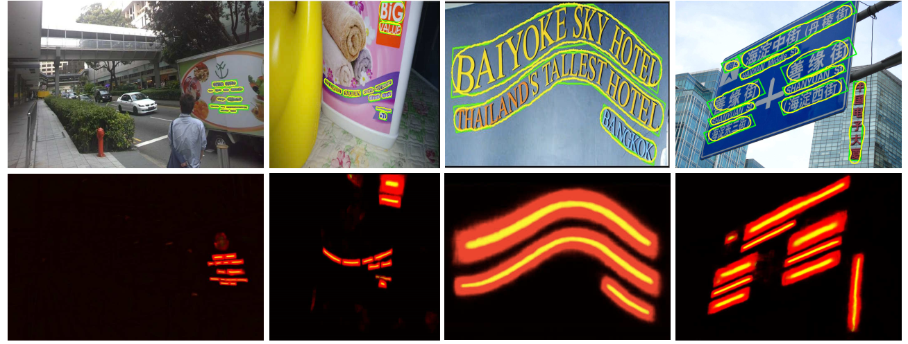

Fig. 8. Qualitative results by the proposed method. Top: Detected text contours (in yellow) and ground truth annotations (in green). Bottom: Combined score maps for TR (in red) and TCL (in yellow). From left to right in column: image from ICDAR 2015, TotalText, CTW1500 and MSRA-TD500. Best viewed in color.    

- 曲文数据库（Total-Text和CTW1500）

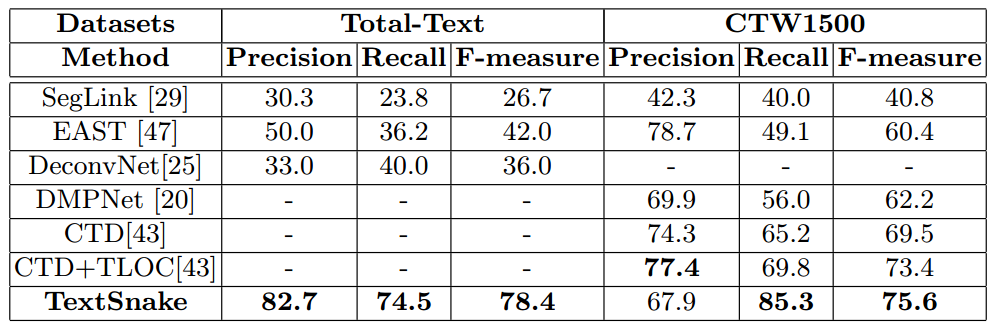

- 倾斜文本数据库（ICDAR2015和MSRA-TD500）

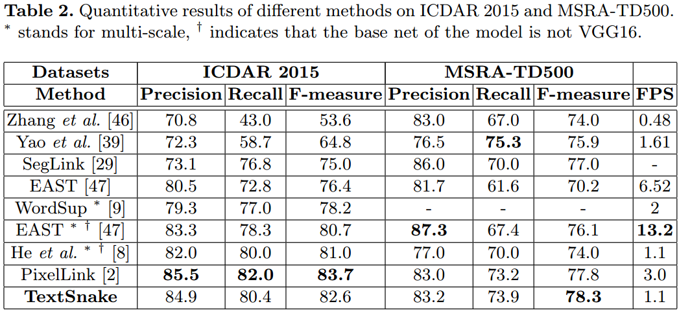

- TextSnake表示法的几何属性可以用来做曲文的矫正方便识别（得益于TCL）

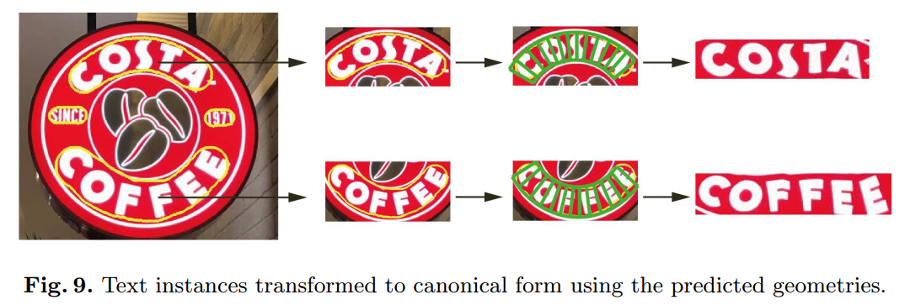

- 泛化能力（不在曲文数据库上进行微调，只在倾斜文本库上进行fine-tune结果也适用于曲文）

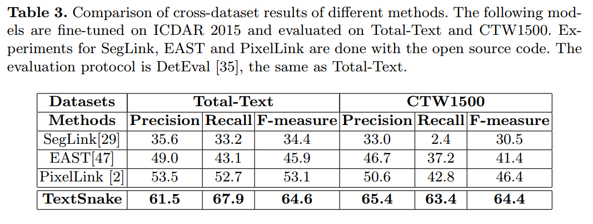

## 总结与收获

这篇方法有意思的是提出用圆盘序列（TextSnake）来表示曲文，但是文中有多处其实有歧义或者说没有说清楚实际的具体方法，比如$\theta$和c的不互斥性、最后的重构方法、中心化的具体方法等等。应该说方法很有创新性，结果也比较好。

