# Sheng Zhang_AAAI2018_Feature Enhancement Network_A Refined Scene Text Detector

## 作者    

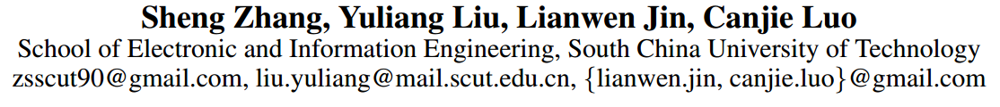

## 关键词

文字检测、水平文字、Faster- RCNN、xywh、multi-stage

## 方法亮点

- Feature Enhancement RPN (FE-RPN)  ：在原来的RPN基础上增加了两个卷积分支来增强文字特征的鲁棒性，一个分支通过增加长条形卷积核来提高对长条形文字的检测能力， 另一个分支利用增加池化和上采样层等方式来扩大感受野以此提高对文字大小的鲁棒性。
- Adaptively Weighted Position-Sensitive RoI Pooling：通过增加ROI pooling的池化网格种类数并取加权平均的方式来保证针对不同大小的文字都能进行自适应的池化。

## 方法概述

本文方法是对Faster RCNN进行改造，改造的点主要包括对增加RPN卷积的分支、特征融合时参照HyperNet压缩中间层特征、ROI Pooling增加网格种类数并进行加权平均这几点来检测水平文本。

## 方法细节

##### 网络结构

该网络框架是Faster RCNN。主要修改是图中的四个红色虚线框。

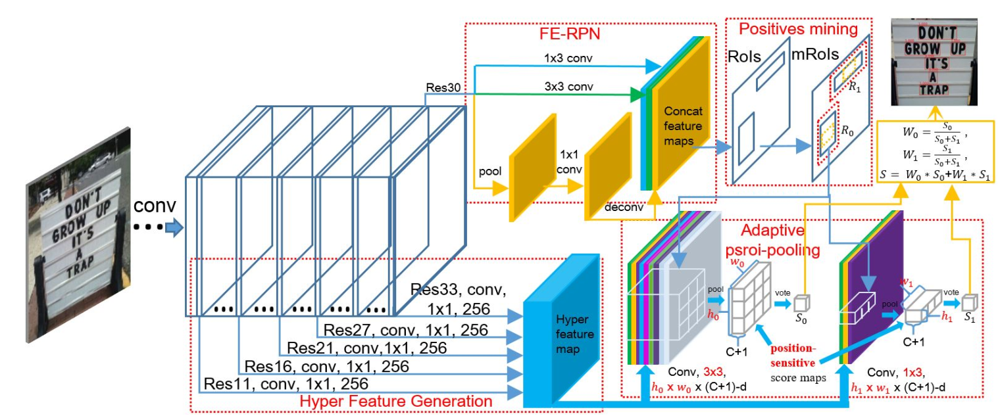

Figure 1: The overall architecture of our FEN. It consists of three innovative components. 1, Feature Enhancement network stem with Feature Enhancement RPN (FE-RPN) and Hyper Feature Generation; 2, Positives mining; 3, Adaptively weighted position-sensitive RoI pooling.    

##### FE-RPN

原来的RPN只有$3*3$的卷积核，现在增加了两个分支。

一个分支是一个$1*3$的长条形卷积核，主要是为了检测长条形文字。

另一个分支是一个池化 +一个$1*1$的卷积 +一个上采样层。这个分支主要是为了扩大感受野增加对文字大小的鲁棒性。 

##### Hyper Feature Generation

其实就是一个多层特征融合的类似于FPN的结构。

Previous object detection approaches always make full use of single scale and high level semantic feature to conduct the refinement of object detection, which may lose much information of object details and thus insufficient for accurate objection localization, especially for smaller text regions.    

In a word, high level semantic feature is conducive to object classification while low level feature is beneficial for accurate object localization.  

In HyperNet，feature maps originated from different intermediate layers have different spatial size and are merged together by pooling, convolution, deconvolution operations.  

##### Positive Mining

利用对groundTruth做一些scale上的随机变换，以此来扩增正样本（利用的原理是：框在小范围内波动都可以视为正确的检测）

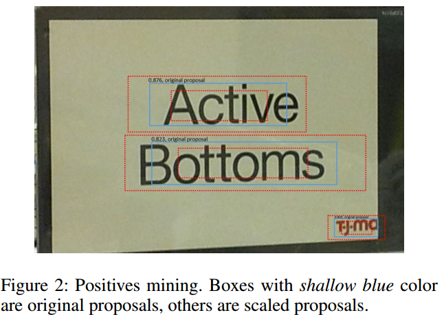

##### Adaptively Weighted Position-Sensitive RoI Pooling

原来只有1个$7*7$的池化，这种方形池化不适合文字这种长条形目标。所以又增加了$3*7，3*3$等多种池化方式，然后采用加权平均方式来算得到最终池化结果。 

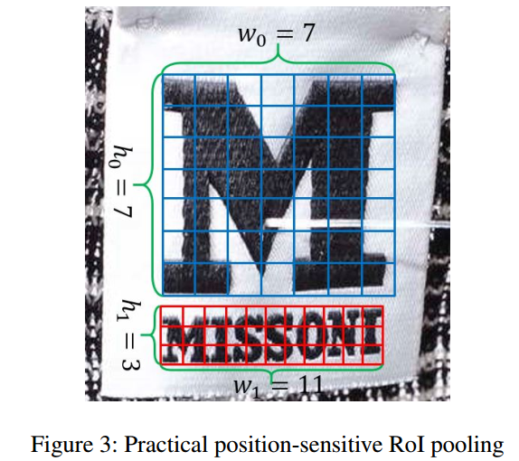

+ 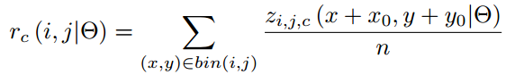

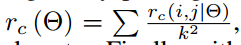

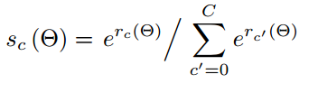

Clearly, different pooling sizes are suitable for different text regions which own different spatial sizes and aspect-ratios, the most suitable pooling size will get the highest score.

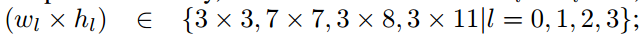

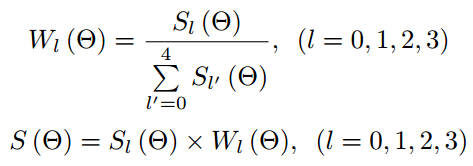

Moreover, with regard to bounding-box regression, we will share the evaluated adaptive weight and do it in the same way.

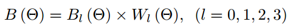

## 实验结果

- 每个步骤的有效性

Table 1: The effectiveness of different components of our method on ICDAR 2011 and 2013 robust text detection datasets. IC13 Eval: ICDAR 2013 evaluation criterion; DetEval: (Wolf and Jolion 2006); R: recall; P: precision; F: F-measure. PM: Positives Mining. FENS: Feature Enhancement Network Stem. MT: multi-scale test.

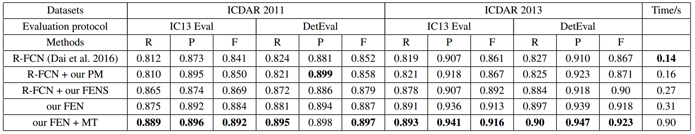

- ICDAR2011和ICDAR2013

Table 2: Comparison with state-of-the-art methods on ICDAR 2011 and 2013 robust text detection datasets. IC13 Eval: ICDAR 2013 evaluation criterion; DetEval: (Wolf and Jolion 2006); R: recall; P: precision; F: F-measure. MT: multi-scale test.    

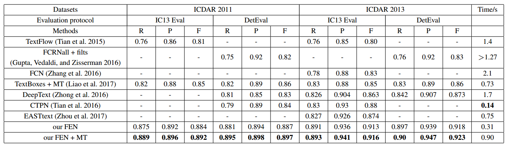

- Positive Mining(PM)的有效性

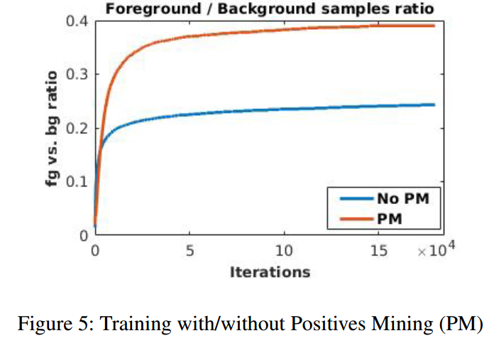

## 总结与收获

这篇文章改进的方法主要是针对文字特征进行enhance，主要思路简单说就是增加分支扩大网络宽度。

