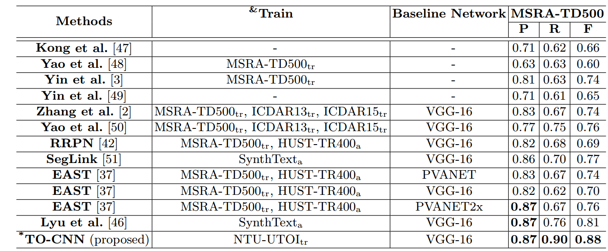
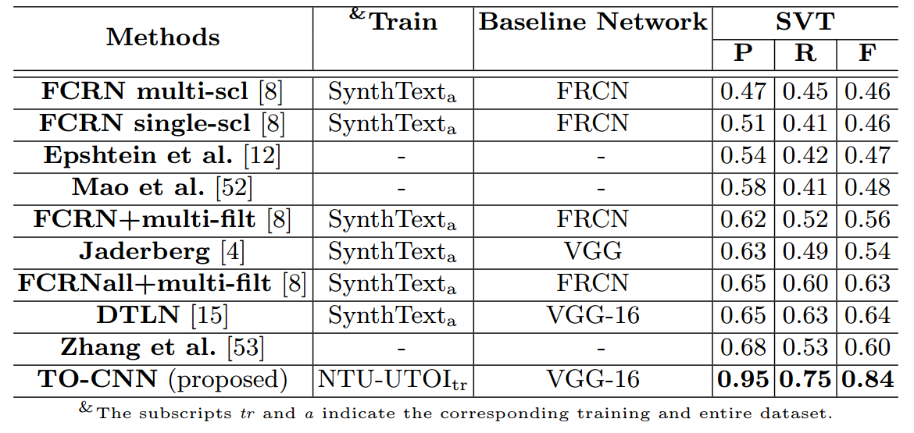
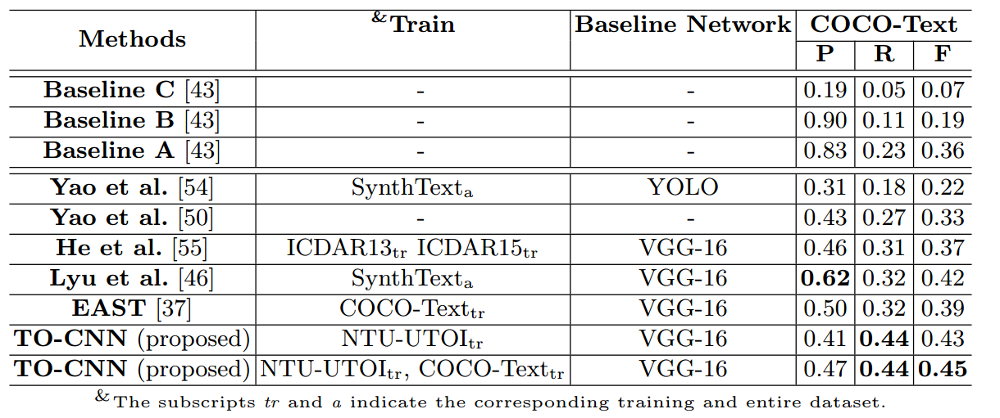
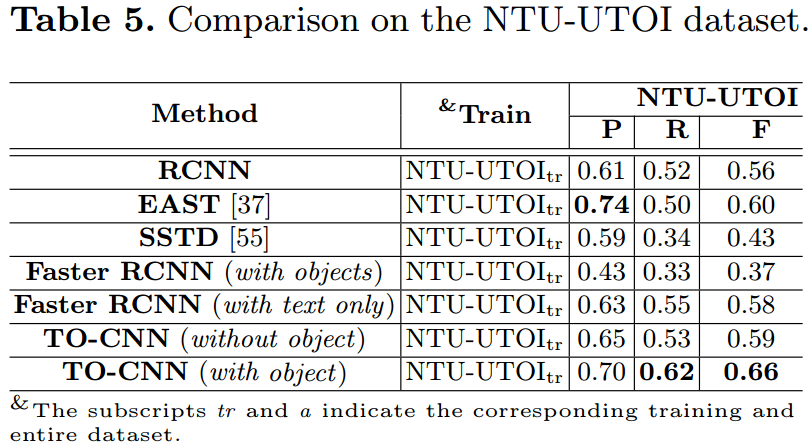
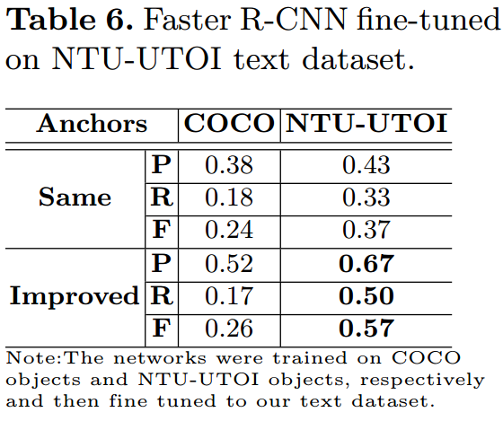

# Shitala Prasad_ECCV2018】Using Object Information for Spotting Text

## 作者和代码    

## 关键词

文字检测、水平文本、FasterRCNN、xywh、multi-stage

## 方法亮点

作者argue图像中的文字不可能单独出现，文字一定是写在什么载体上的，比如衣服，包装袋，交通部标志牌，黑板上，而且文字不会出现在某些载体上，比如天空，水面上，也就是说文字背后的载体对文字是否出现也有很强的相关性和指导性。所以，他串联了两个网络，第一个用来做通用目标检测，比如检测刚才说的衣服黑板等，第二个用来定位文字。通过利用这个文字载体的信息来辅助定位文字。这个方法确实对结果有提高，不过需要对数据集有要求，需要标注除文字外的其他物体（类似于COCO），所以作者又提出了一个2万多的数据集-NTU-UTOI(22k)。

There exists a strong relationship between certain objects and the presence of text, such as signboards or the absence of text, such as trees.     

## 方法概述

本文方法利用Faster RCNN来做文字检测（水平），改进的地方在于backbone增加了一个VGG-16 net，该子网络用于学习图像中的所有Object信息（包括文字、背景里的各种目标类），采用了三步分段训练方式来训练模型。实验表明，把文字载体的类别信息融合进去后对文字检测结果有很大提升。

## 方法细节

##### 方法流程

TO-CNN采用Faster RCNN框架，网络结构： backbone（Object VGG-16 + Text VGG-16） + RPN + Regression部分。

其中对于Object VGG-16和Text VGG-16的训练网络结构如下：。

+ Object VGG-16 + RPN + Regression构成第一个网络，用于通用目标检测（42类object），如下图a；

+ Object VGG-16 + Text VGG-16 + RPN + Regression构成第二个网络，用于文字检测（2类），如下图b。注意Object VGG-16是从第一个网络来的。

  

Fig. 3. The proposed TO-CNN for text spotting based on object information. (a) Illustrates the first training stage to extract object information and store in the Object CNN. (b) Illustrates the second training stage to tune the parameters in the Text CNN and the third training stage to fine tune the entire network for text spotting.

##### 三个训练阶段

该方法分为三个训练阶段。

- Stage1： 训练第一个通用目标检测网络，（Object的类目信息已存储在Object VGG-16 net里）

Once the network is fully trained, the object and text information would be stored in the VGG-16 net.     

- Stage2：固定Object VGG-16，训练第二个文字检测网络，（增加一个新的VGG-16 net，Text VGG-16 net）

In this stage, the Text VGG-16 net takes the object and text features from the Object VGG-16 to tune its parameters for text detection. From another point of view, the Text VGG-16 net fuses the text and object features for text detection.     

- Stage3： 不固定Object VGG-16，训练第二个文字检测网络

At the end of this training stage, the network is fully optimized for text spotting based on object and text information.    

##### 其他细节

+ 两个网络stack的方式采用的是：stacked hourglass approach（Yang, J., Liu, Q., Zhang, K.: Stacked hourglass network for robust facial landmark localisation. In: Computer Vision and Pattern Recognition Workshops (CVPRW), 2017 IEEE Conference on, IEEE (2017) 2025–2033）

## 实验结果

- NTU-UTOI数据集

  该数据集是由几个已有的public公开数据集（只包含训练集，不包含测试集），并标注了42类object组成。

  + 22,767 images from ICDAR 2011 robust scene text, ICDAR 2015 incident scene text, KAIST scene text, MSRA-TD500, NEOCR11, SVT, USTBSV1k, and Traffic Sign datasets, together with images collected from the Internet and authors’ personal collections. 
  + 18,173 images are used for training and the rest 4,594 images are used for testing.    

- MSRA-TD500

- SVT

- COCO-Text

- NTU-UTOI

- 在NTU-UTOI上fine-tune之后

- 不同anchor的比较

## 总结与收获

这篇方法的idea很有意思。通过利用text背后的载体信息来帮助文字的定位，这个思想其实不是这篇文章首创，Yingli Tian_CVPR2017】Unambiguous Text Localization and Retrieval for Cluttered Scenes这篇文章里其实有提过相似的思想。

