# XiangBai_CVPR2018_Rotation-Sensitive Regression for Oriented Scene Text Detection

## 作者和代码    

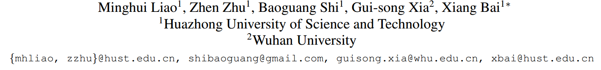

[caffe代码](https://github.com/MhLiao/RRD)

## 关键词

文字检测、多方向、SSD、$$xywh\theta$$、one-stage，开源

## 方法亮点

+ 核心思想认为，分类问题对于旋转不敏感，但回归问题对于旋转是敏感的，因此两个任务不应该用同样的特征。所以作者提出来基于旋转CNN的思路，先对特征做不同角度的旋转，该特征用于做框的回归，而对分类问题，采用沿oriented response pooling，所以对旋转不敏感。 

  Text coordinates are sensitive to text orientation. Therefore, the regression of coordinate offsets should be performed on rotation-sensitive features.    

  In contrast to regression, the classification of text presence should be rotation-invariant, i.e., text regions of arbitrary orientations should be classified as positive.    

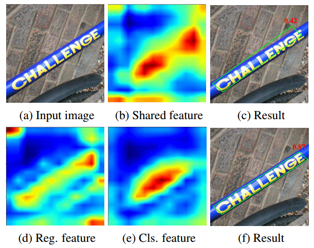

Figure 1: Visualization of feature maps and results of baseline and RRD. Red numbers are the classification scores. (b): the shared feature map for both regression and classification; (c): the result of shared feature; (d) and (e): the regression feature map and classification feature map of RRD; (f): the result of RRD.

+ 首次使用Oriented Response Convolution来做文字检测

## 方法概述

本文方法是SSD进行修改，除了修改输出预测4个点坐标偏移量来检测倾斜文本外，还利用了ORN来提取旋转敏感的文字特征，然后在分类分支增加最大池化来提取针对分类不敏感的特征。

## 方法细节

##### 网络结构

该网络结构由SSD改造，不同的是原来的多层融合侧边连接是普通的卷积，但这里换成了RSR。每一个RSR分为两个部分，第一部分是把卷积改成多种不同方向的oriented convolution。第二部分是用来做predicition，包括regression和classification两个分支。classification分支的不同地方在于多了一个oriented response pooling。

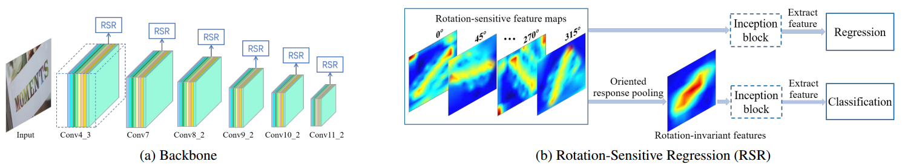

Figure 2: Architecture of RRD. (a) The rotation-sensitive backbone follows the main architecture of SSD while changing its convolution into oriented response convolution. (b) The outputs of rotation-sensitive backbone are rotation-sensitive feature maps, followed by two branches: one for regression and another for classification based on oriented response pooling. Note that the inception block is optional.    

##### ORN（Oriented response net-works）

目的：通过使用旋转滤波器（active rotating filters，ARF）来提起对旋转敏感（rotation-sensitive）的卷积特征

方法来源：Y. Zhou, Q. Ye, Q. Qiu, and J. Jiao. Oriented response networks. In CVPR, 2017.    

github链接：https://github.com/ZhouYanzhao/ORN

主要思想：

##### Rotation-Invariant Classification    

简单说，就是把所有方向的结果逐像素取个最大值。如果文字是某个方向的，那么对应的方向的response应该比较大，这样就能把该方向的特征抽取出来（因为原来的feature有多个方向的，但只给定feature是不知道具体是哪个方向的，不能把它单独拿出来，用Max就可以不管是哪个方向都能提取出来）。

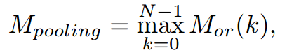

The rotationsensitive feature maps are pooled along their depth axis.    

##### Default Boxes

使用四个顶点的四边形来表示。最后prediction的是四个点坐标的offset。

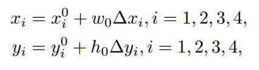

##### 训练

+ 作者argue第一个点的选择很重要，文中采用了textbox++提供的方法来确定第一个点

+ 计算IOU的时候为了简化直接用了最外接矩形bb的IOU

+ 损失函数 = 分类-2类softmax损失 + 回归-smooth_L1损失

  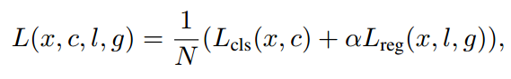

## 实验结果

- Ablation 实验

**Baseline**: architecture without inception block, using shared conventional feature maps for both regression and classification; 

**Baseline+inc**: baseline architecture using inception blocks; 

**Baseline+inc+rs**: architecture with inception block, using rotation-sensitive features for both regression and classification; 

**Baseline+inc+rs+rotInvar**: the proposed RRD. Note that for word-based datasets, inception block is not applied and we also name it RRD.    

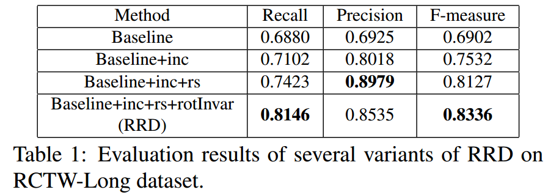

- 在RCTW-17、ICDAR2015、MSRA-TD500上的实验结果

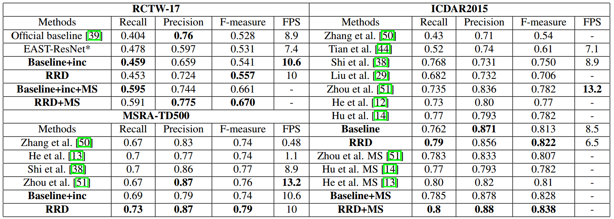

+ 不同IOU实验结果

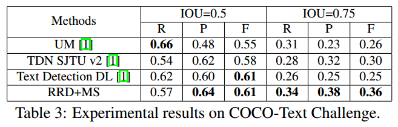

+ ICDAR2013实验结果

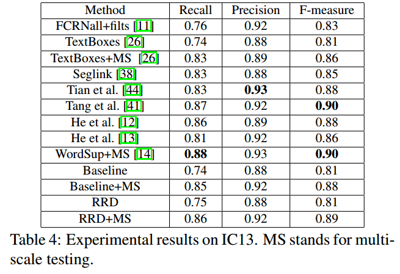

+ 在其他数据集（ship，HRSC2016）检测上结果

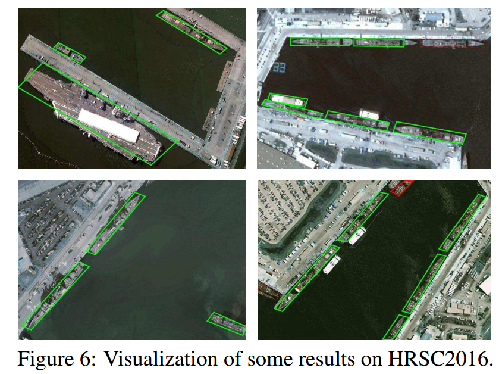

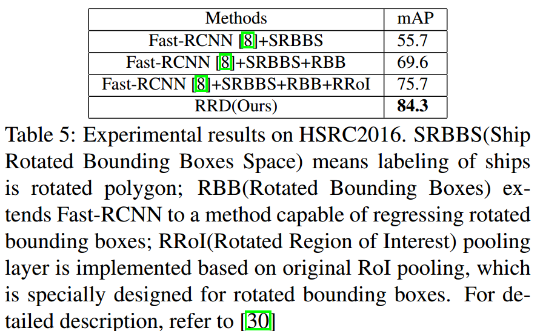

+ 当前文字检测结果中常见的歧义性

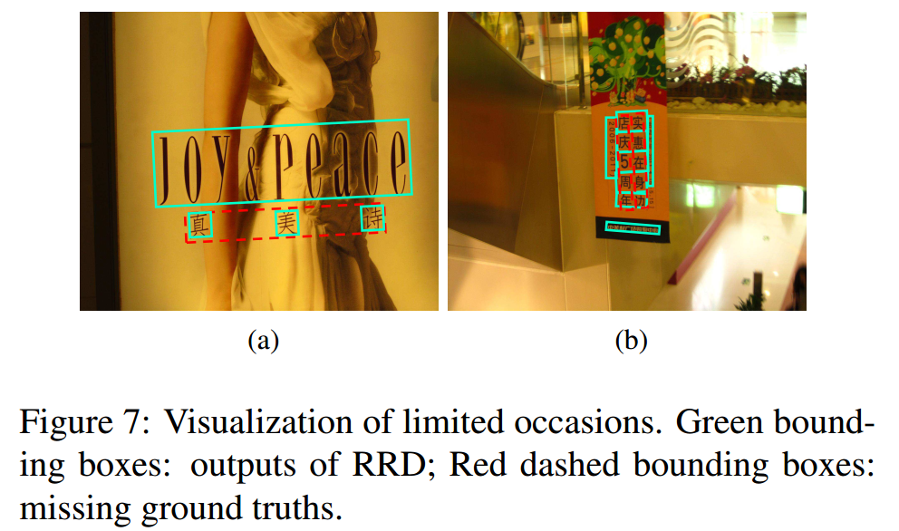

## 总结与收获

这篇文章的key idea和R-FCN有点像。检测对于平移、旋转具有敏感性，但分类不具有。所以这篇文章的方法是通过一个最大池化来去掉分类特征对旋转的敏感性。另外，这是第一篇把oriented response net-works引入ocr检测的文章。

