# Yuliang Liu_2017_Detecting Curve Text in the Wild_New Dataset and New Solution

## 作者和代码    

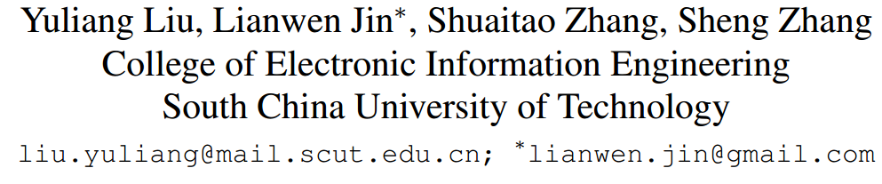

[caffe版代码](https://github.com/Yuliang-Liu/Curve-Text-Detector)

## 关键词

文字检测、曲文、直接回归、14个点、one-stage、开源

## 方法亮点

- 第一篇做曲文检测，还提出一个数据集CTW1500
- 使用14个点多边形来表示曲文
- 提出了一个结合CNN-RPN+RNN的检测方法专门做曲文检测

## 方法概述

本文方法基于RPN进行修改，除了学习text/non-text分类，多边形的bounding box回归（x1,y1,x2,y2），增加了14个点的回归，最后再进行后处理（去噪+nms）得到最终输出。

## 方法细节

##### 用多边形比用四边形表示曲文更好

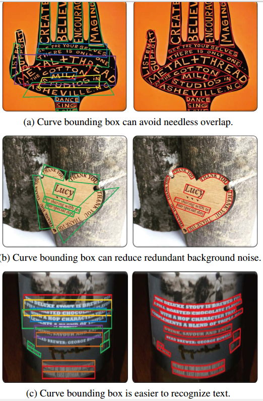

##### 网络结构

分三个分支。

+ 第一个text/non-text分支，普通的分类任务
+ 第二个分支是整个曲文（多边形）的最外接正矩形bounding box的x1，y1，x2，y2回归任务
+ 第三个分支是14个点的点坐标的回归任务。包括采用类似R-FCN方式进行画网格pooling、以及用RNN来增加上下文信息做平滑

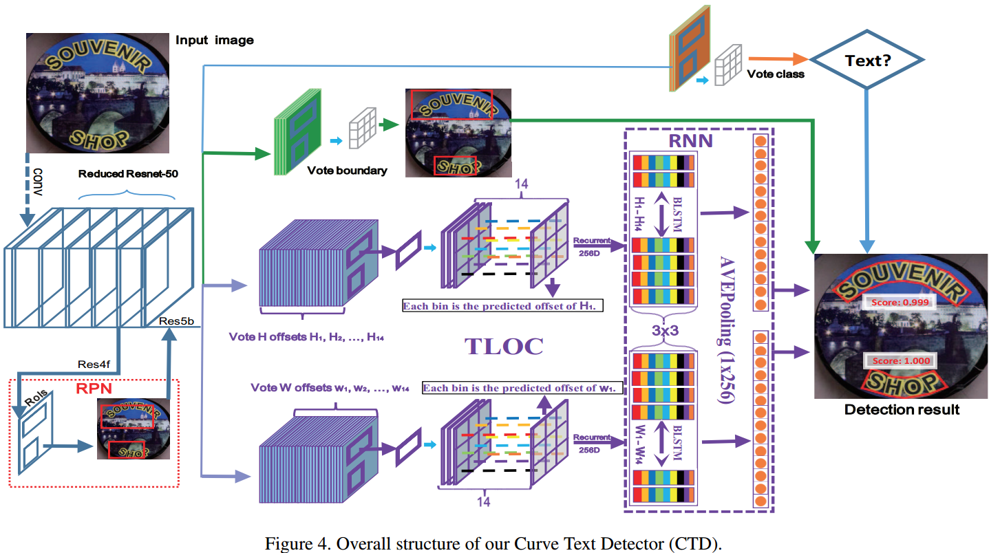

##### regression输出

使用32个值 = 14*2=28个坐标偏移量 + 多边形的boundingbox的4个值（x1, y1, x2, y2）

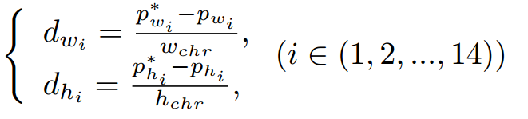

##### Recurrent Transverse and Longitudinal Offset Connection (TLOC)   

+ PSROIPooling： Position-sensitive ROI Pooling，类似于R-FCN，因为14个点分布的位置不同，故采用这种和位置相关的pooling
+ 把x、y分开成两个branch
+ 总的loss = 二类分类 +  bounding box 回归 + 坐标点回归

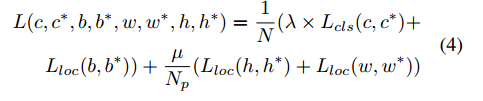

+ 使用RNN来平滑点（点坐标可以看做是序列问题，上下文相关性强，例如第4个点必须在第2个点的右边，有隐性约束条件，故可以用RNN来平滑）

Independently predicting each offset may lead to unsmooth text region, and somehow it may bring more false detection. Therefore, we assume the width/height of each point has associated context information, and using RNN to learn their latent characteristics. We name this method as recurrent transverse and longitudinal offset connection (TLOC).

+ 是否使用TLOC的效果对比

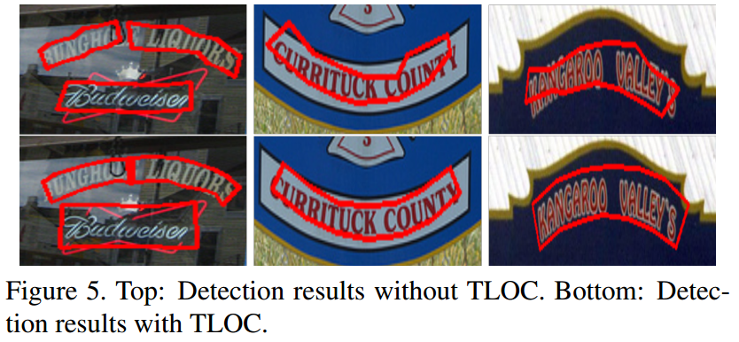

##### CTW1500数据集

+ 图像数1500，10751个bounding boxes，3530 curve bounding boxes，at least one curve text per image.    
+ 数据来源：google Open-Image 、自己手机收集样本
+ 标记点采用14个点

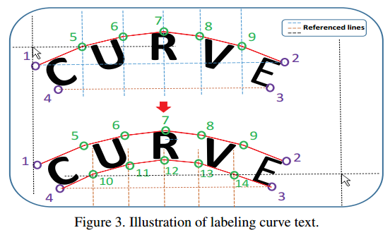

+ 标记不同框的效率对比

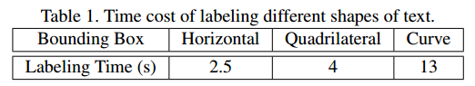

+ CTW样例图

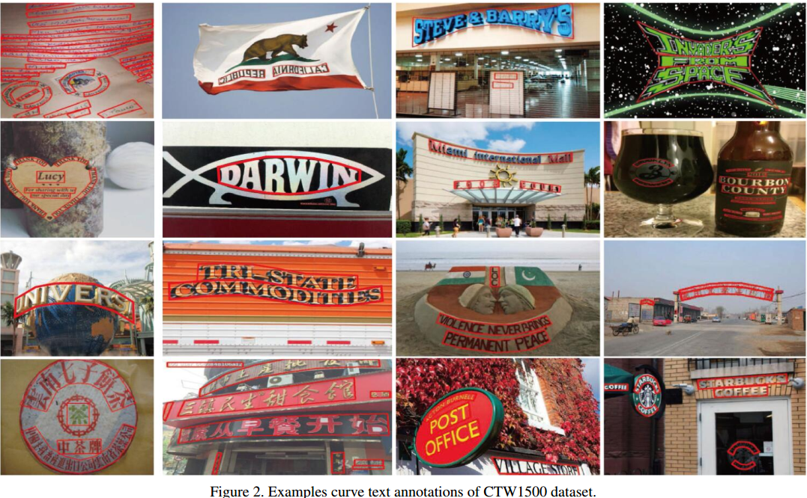

##### 长边插值

对于只有两个或四个点的annotation采用均匀差值到14个点

Figure 6. Visualization of the interpolation for 4 points bounding boxes. The 10 equal division points will be respectively interpolated in two Red sides of each bounding box. Green means straight line without interpolation.  

##### 后处理NMS

+ 去掉无效的多边形（比如不能有相交的边）
+ 进行多边形的NMS（计算多边形的交并比）

## 实验结果

- CTW1500

  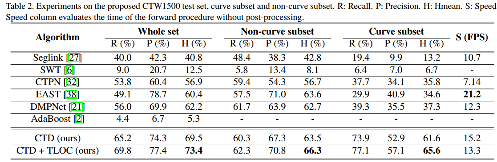

- TLOC和NMS结果

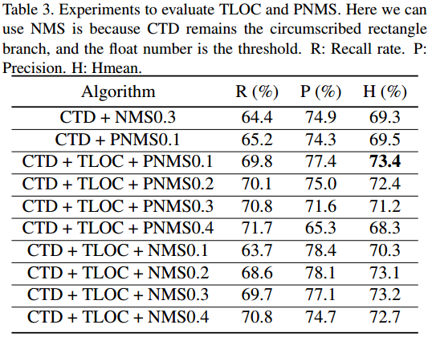

- 实验结果示例

## 总结与收获

CTD这篇华南理工的是第一个做曲文检测的。以前有人做过曲文的不过主要是识别，这是第一次做检测，而且还提出了一个专门做曲文的数据库CTW1500。这个方法的核心在于统一用14个点来表示曲线文字，然后因为相邻的点之间应该要有一定上下文的相关性（相邻点不能跑太远），所以作者用了RNN来做平滑。

